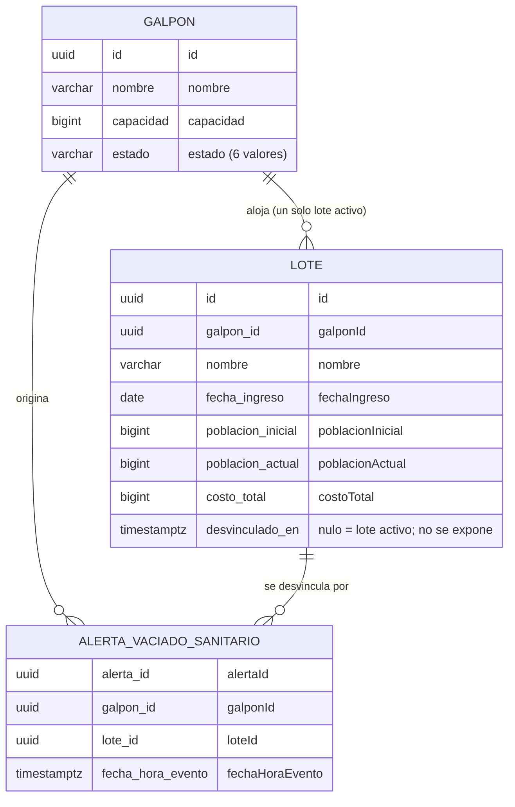

# Acuerdo de contratos entre módulos - AVICONTROL

**Fecha**: 2026-10-05
**Autor**: Módulo 1 - Gestión de Galpones e Infraestructura
**Destinatarios**: Módulo 2 (productor de eventos y consumidor de consultas) y Módulo 3 (consumidor de consultas)
**Estado**: propuesta del Módulo 1, pendiente de acordar. Los puntos marcados con un ID (`P-nn`) están en [pendientes-clarificacion.md](pendientes-clarificacion.md).

## 1. Propósito y alcance

Este documento fija lo que ambos lados deben tener **idéntico** para que los módulos se entiendan: nombres, tipos, formatos, valores permitidos y reglas de entrega. Lo que no está aquí es interno de cada módulo y puede diferir.

Cubre los cuatro specs del Módulo 1 que son frontera con otros módulos:

| Spec del Módulo 1 | Dirección | Mecanismo |
|---|---|---|
| Recibir mortalidad del galpón | Módulo 2 → Módulo 1 | Evento Kafka |
| Recibir alerta sanitaria | Módulo 2 → Módulo 1 | Evento Kafka |
| Recibir vaciado sanitario | Módulo 2 → Módulo 1 | Evento Kafka |
| Consultar galpón y lote | Módulos 2 y 3 → Módulo 1 | REST (`GET`) |

Cada plan de implementación del Módulo 1 contiene el detalle completo de su servicio; este documento reúne solo lo que el otro módulo necesita ver.

## 2. Reglas comunes

Aplican a todos los eventos y servicios de este documento.

| Regla | Valor |
|---|---|
| Formato | JSON, UTF-8 |
| Nombres de campo | `camelCase`; enumeraciones en `MAYUSCULA_CON_GUION_BAJO` |
| Identificadores | UUID, siempre como texto |
| Fechas | `yyyy-MM-dd` para una fecha; instante en ISO-8601 **con desplazamiento** (`2026-10-05T14:30:00-05:00`). Nunca un instante sin zona. |
| Zona de negocio | `America/Bogota`. "Hoy" y "mismo día" se evalúan en esa zona. |
| Enteros | Sin decimales. `25` es válido; `25.0` y `"25"` no. |
| Costos | Pesos colombianos, entero |
| Nulos | Nunca se envía `null`: un campo que no aplica se **omite** |
| Campos desconocidos | El receptor los ignora, para permitir que el contrato evolucione |

### 2.1 Estados del galpón

Seis valores exactos, escritos así:

`DISPONIBLE`, `VACIADO_SANITARIO`, `PRODUCTIVO`, `EN_COSECHA`, `MANTENIMIENTO`, `AISLAMIENTO`

Ningún módulo debe inventar, traducir ni abreviar un estado.

### 2.2 Ciclo de vida y qué evento corresponde a cada estado

```text
DISPONIBLE ──(registrar lote)──► PRODUCTIVO ──(administrador)──► EN_COSECHA
    ▲                              │   ▲                            │
    │                  alerta      │   │ alerta de                  │ alerta de vaciado
    │                  sanitaria   ▼   │ reanudación                ▼ (Módulo 2)
    │                           AISLAMIENTO ──(administrador)──► EN_COSECHA
    │
    └────────── proceso automático ◄──────────── VACIADO_SANITARIO
```

`DISPONIBLE ⇄ MANTENIMIENTO` es interno del Módulo 1 (alertas de mantenimiento) y no genera eventos hacia otros módulos.

| Evento del Módulo 2 | Solo es válido si el galpón está en... | Efecto en el Módulo 1 |
|---|---|---|
| Mortalidad | `PRODUCTIVO`, con el lote activo | Descuenta de `poblacionActual` |
| Alerta sanitaria `AISLAMIENTO` | `PRODUCTIVO` | Pasa a `AISLAMIENTO` |
| Alerta sanitaria `REANUDACION` | `AISLAMIENTO` | Pasa a `PRODUCTIVO` |
| Vaciado sanitario | `EN_COSECHA` | Pasa a `VACIADO_SANITARIO` y desvincula el lote |

El Módulo 1 **no publica eventos** hacia otros módulos. El regreso de `VACIADO_SANITARIO` a `DISPONIBLE` lo hace un proceso del Módulo 1 sin avisar; el Módulo 2 lo ve al consultar.

### 2.3 Entidades que cruzan la frontera

Del modelo de datos del Módulo 1, estas son las entidades que los otros módulos ven o referencian. El texto entre comillas es el nombre del campo en el contrato; las columnas internas del Módulo 1 pueden diferir y no se exponen.



- El Módulo 2 **referencia** galpones y lotes por UUID en sus eventos y **lee** galpones y lotes por la API de consulta (sección 4).
- Un galpón tiene muchos lotes a lo largo del tiempo, pero **uno solo activo**. Un lote deja de ser activo cuando se acepta el vaciado sanitario.
- El Módulo 1 guarda la alerta de vaciado aceptada; **no guarda** la alerta sanitaria ni la de mortalidad como entidades de negocio.
- `desvinculado_en` no se expone: los otros módulos solo ven si hay `loteActivo` o no.

## 3. Eventos (Módulo 2 → Módulo 1)

### 3.1 Tópicos y entrega

| Elemento | Valor |
|---|---|
| Tópico de mortalidad | `avicontrol.mortalidad` |
| Tópico de alerta sanitaria | `avicontrol.alerta-sanitaria` |
| Tópico de vaciado sanitario | `avicontrol.vaciado-sanitario` |
| Grupo de consumo | `modulo-1` |
| Clave de partición | **`galponId`** en los tres tópicos, incluso si la alerta sanitaria nace de un lote |
| Valor del mensaje | JSON dentro del sobre de la sección 3.2 |

La clave de partición no es opcional: garantiza que los mensajes de un mismo galpón se procesen en orden (un aislamiento y su reanudación no pueden cruzarse).

### 3.2 Sobre del evento

El Módulo 2 define un sobre estándar. El Módulo 1 lo lee y toma los datos de `payload` (P-06).

| Campo del sobre | Uso en el Módulo 1 |
|---|---|
| `eventType` | Se valida contra el tópico (valores a acordar) |
| `eventVersion` | Se acepta `1`; otra versión se rechaza |
| `payload` | Contiene los campos de negocio de las secciones 3.3 a 3.5 |
| `eventId`, `occurredAt`, `publishedAt`, `producer`, `correlationId`, `causationId`, `aggregateType`, `aggregateId` | Se ignoran (solo informativos) |

Valores propuestos de `eventType`, a confirmar: `MORTALIDAD_REGISTRADA`, `ALERTA_SANITARIA_EMITIDA`, `VACIADO_SANITARIO_SOLICITADO`.

```json
{
  "eventId": "6f2d9c1a-0b7e-4e4a-9d51-3c8a7b1e2f90",
  "eventType": "MORTALIDAD_REGISTRADA",
  "eventVersion": 1,
  "occurredAt": "2026-10-05T14:30:00-05:00",
  "publishedAt": "2026-10-05T14:30:02-05:00",
  "producer": "modulo-2",
  "aggregateType": "Galpon",
  "aggregateId": "550e8400-e29b-41d4-a716-446655440000",
  "payload": { "...": "ver sección 3.3" }
}
```

`eventId` identifica una entrega; **no** sustituye al `alertaId`, que es la clave de idempotencia.

### 3.3 Mortalidad del galpón

`payload`:

| Campo | Tipo | Obligatorio | Regla |
|---|---|---|---|
| `alertaId` | UUID | sí | Clave de idempotencia; no puede reutilizarse con datos distintos |
| `galponId` | UUID | sí | Debe existir y estar `PRODUCTIVO` |
| `loteId` | UUID | sí | Debe ser el lote activo de ese galpón |
| `fechaHoraEvento` | instante | sí | No futura y del mismo día de recepción (America/Bogota) |
| `cantidadMuertos` | entero | sí | Mayor que 0 |

```json
{
  "alertaId": "9d3c0b2e-6a58-4c42-8b0c-2a1f3f0f7a11",
  "galponId": "550e8400-e29b-41d4-a716-446655440000",
  "loteId": "2fc03a21-84c4-4c83-bb15-6607bb75cb90",
  "fechaHoraEvento": "2026-10-05T14:30:00-05:00",
  "cantidadMuertos": 25
}
```

Resultado en el Módulo 1:

| Caso | Resultado |
|---|---|
| Datos válidos | Descuenta `cantidadMuertos` de `poblacionActual` del lote |
| Mismo `alertaId` y mismos datos | Ignorado: no descuenta otra vez |
| Mismo `alertaId` con datos distintos | Rechazado por inconsistencia |
| Galpón o lote inexistente, lote que no es del galpón o no activo, galpón no `PRODUCTIVO` | Rechazado |
| Cantidad 0, negativa, decimal o texto; fecha futura o de otro día | Rechazado |
| Cantidad mayor que la población actual | Rechazado |
| Cantidad que deja la población en 0 | Aceptado; no cambia el estado del galpón |

### 3.4 Alerta sanitaria

`payload`:

| Campo | Tipo | Obligatorio | Regla |
|---|---|---|---|
| `alertaId` | UUID | sí | Lo genera el Módulo 2; el Módulo 1 **no la guarda** |
| `accion` | texto | sí | `AISLAMIENTO` o `REANUDACION` |
| `galponId` | UUID | uno de los dos | Galpón afectado |
| `loteId` | UUID | uno de los dos | Lote activo; el galpón se resuelve desde el lote. Si vienen ambos, deben coincidir |
| `fechaHora` | instante | sí | Del día actual; la hora puede variar |
| `tipoEnfermedad` | texto | solo con `AISLAMIENTO` | Tipo de enfermedad o sospecha |
| `descripcion` | texto | solo con `AISLAMIENTO` | Descripción de la novedad |
| `gravedad` | texto | no | Opcional |

```json
{
  "alertaId": "5b1c7d52-3a08-4f0e-9c1d-77a1d4e0b6aa",
  "accion": "AISLAMIENTO",
  "galponId": "550e8400-e29b-41d4-a716-446655440000",
  "fechaHora": "2026-10-05T09:15:00-05:00",
  "tipoEnfermedad": "Sospecha de Newcastle",
  "descripcion": "Mortalidad atípica y signos respiratorios"
}
```

Reglas propias de este evento:

- El Módulo 1 no valida `tipoEnfermedad` ni `gravedad` contra un catálogo, así que el Módulo 2 es libre de definir los suyos.
- No hay registro de alertas procesadas. Una reentrega de `AISLAMIENTO` sobre un galpón que ya está en `AISLAMIENTO` se rechaza por estado incompatible; es un rechazo esperado y no una falla.
- El Módulo 1 no modifica población, fecha, costo ni ningún otro dato del lote.

### 3.5 Vaciado sanitario

`payload`:

| Campo | Tipo | Obligatorio | Regla |
|---|---|---|---|
| `alertaId` | UUID | sí | Clave de idempotencia; no puede reutilizarse con datos distintos |
| `galponId` | UUID | sí | Debe existir y estar `EN_COSECHA` |
| `loteId` | UUID | sí | Debe pertenecer a ese galpón |
| `fechaHoraEvento` | instante | sí | No futura y del mismo día de recepción |

```json
{
  "alertaId": "0c8e2a11-5d4f-4b7a-a3e9-1f6b2c9d8e47",
  "galponId": "550e8400-e29b-41d4-a716-446655440000",
  "loteId": "2fc03a21-84c4-4c83-bb15-6607bb75cb90",
  "fechaHoraEvento": "2026-10-05T16:00:00-05:00"
}
```

Reglas propias de este evento:

- **Precondición**: el galpón debe estar `EN_COSECHA` en el Módulo 1 (lo cambia el administrador). Si el Módulo 2 emite antes, el mensaje se rechaza. El Módulo 2 debe emitir solo después de ver ese estado.
- **Efecto**: en una sola transacción se guarda la alerta aceptada, se **desvincula el lote** del galpón y el galpón pasa a `VACIADO_SANITARIO`.
- **Después de aceptado**, la consulta del lote activo de ese galpón no devuelve lote. El Módulo 2 no debe enviar más mortalidad ni alertas sanitarias de ese lote.
- Mismo `alertaId` y mismos datos: ignorado. Mismo `alertaId` con datos distintos: rechazado.

### 3.6 Reglas de entrega (los tres tópicos)

| Tema | Acuerdo propuesto |
|---|---|
| Idempotencia | La clave es `alertaId` (no `eventId`). El Módulo 2 puede reenviar; el Módulo 1 tolera duplicados. |
| Orden | Garantizado por galpón gracias a la clave de partición |
| Versión | `eventVersion` = 1; cambios incompatibles suben la versión |
| Campos nuevos | Se pueden agregar sin avisar: el Módulo 1 los ignora |
| Rechazos | Kafka no responde al productor. Hoy el Módulo 1 deja el motivo en su log; si el Módulo 2 necesita enterarse, se define un tópico de respuesta (P-05) |
| Errores técnicos | El Módulo 1 reintenta; los de negocio no se reintentan |

Códigos de rechazo que el Módulo 1 usa en su log y que podrían viajar en un tópico de respuesta:

| Código | Aplica a | Significado |
|---|---|---|
| `ALERTA_INCOMPLETA` | los tres | Falta un campo obligatorio |
| `VERSION_NO_SOPORTADA` | los tres | `eventVersion` no soportada |
| `GALPON_NO_ENCONTRADO` | los tres | El galpón no existe |
| `LOTE_NO_ENCONTRADO` | los tres | El lote no existe |
| `LOTE_NO_PERTENECE_AL_GALPON` | los tres | El lote no es de ese galpón |
| `LOTE_NO_ACTIVO` | mortalidad, sanitaria | El lote no es el activo |
| `GALPON_NO_PRODUCTIVO` | mortalidad | El galpón no está `PRODUCTIVO` |
| `GALPON_NO_EN_COSECHA` | vaciado | El galpón no está `EN_COSECHA` |
| `ACCION_INVALIDA` | sanitaria | `accion` fuera de los dos valores |
| `ACCION_INCOMPATIBLE` | sanitaria | La acción no corresponde al estado actual |
| `GALPON_O_LOTE_REQUERIDO` | sanitaria | No llegó galpón ni lote |
| `DATOS_AISLAMIENTO_INCOMPLETOS` | sanitaria | Falta tipo de enfermedad o descripción |
| `CANTIDAD_INVALIDA` | mortalidad | Cantidad no entera positiva |
| `FECHA_INVALIDA` | los tres | Fecha futura o de otro día |
| `ALERTA_INCONSISTENTE` | mortalidad, vaciado | Mismo `alertaId` con datos distintos |

## 4. API de consulta (Módulos 2 y 3 → Módulo 1)

Servicios de solo lectura. Base: `/api/v1` (P-09, P-10). Todas las respuestas llevan `Cache-Control: no-store`.

### 4.1 Listar galpones

`GET /api/v1/galpones`

| Query param | Tipo | Obligatorio | Por defecto | Regla |
|---|---|---|---|---|
| `nombre` | texto | no | | Búsqueda parcial sin distinguir mayúsculas |
| `estado` | texto | no | | Uno de los seis estados |
| `orden` | texto | no | `nombre,asc` | `campo,dirección`: campo `nombre`, `capacidad` o `estado`; dirección `asc` o `desc` |
| `page` | entero | no | 1 | Mayor o igual a 1. **Tamaño fijo de 10** |

```json
{
  "contenido": [
    { "id": "550e8400-e29b-41d4-a716-446655440000", "nombre": "Galpón Norte", "capacidad": 1500, "estado": "PRODUCTIVO" }
  ],
  "pagina": 1,
  "tamanio": 10,
  "totalElementos": 1,
  "totalPaginas": 1,
  "sinCoincidencias": false
}
```

Si `nombre` no coincide con nada, la respuesta trae todos los galpones con `sinCoincidencias: true` y un `mensaje`.

### 4.2 Detalle del galpón y su lote activo

`GET /api/v1/galpones/{galponId}`

```json
{
  "id": "550e8400-e29b-41d4-a716-446655440000",
  "nombre": "Galpón Norte",
  "capacidad": 1500,
  "estado": "PRODUCTIVO",
  "loteActivo": {
    "id": "2fc03a21-84c4-4c83-bb15-6607bb75cb90",
    "nombre": "Lote A1",
    "poblacionInicial": 1000,
    "poblacionActual": 975,
    "fechaIngreso": "2026-09-15",
    "edadDias": 21,
    "costoTotal": 5000000
  }
}
```

- Un galpón **sin lote activo** responde `200` **sin el campo `loteActivo`** (y con un `mensaje` si nunca tuvo lotes).
- Datos de lote vacíos o inconsistentes no tumban la consulta: se omiten y se informan en `incidencias`.

### 4.3 Historial de lotes del galpón

`GET /api/v1/galpones/{galponId}/lotes` devuelve `galponId`, `loteActivo` (opcional, mismo formato del detalle), `lotesAnteriores` (del más reciente al más antiguo) e `incidencias` (opcional).

### 4.4 Errores

Formato RFC 9457 (`application/problem+json`):

```json
{
  "type": "https://avicontrol.unimag.edu.co/errors/galpon-no-encontrado",
  "title": "Galpón no encontrado",
  "status": 404,
  "detail": "El galpón consultado no existe.",
  "instance": "/api/v1/galpones/550e8400-e29b-41d4-a716-446655440000",
  "code": "GALPON_NO_ENCONTRADO"
}
```

| HTTP | `code` | Caso |
|---|---|---|
| 400 | `PARAMETRO_INVALIDO` | `estado`, `orden`, `page` o `galponId` inválidos |
| 404 | `GALPON_NO_ENCONTRADO` | El galpón no existe |
| 500 | `ERROR_CONSULTA` | Error técnico; el cliente puede reintentar |

Una consulta sin resultados no es un error: es `200` con la lista vacía.

### 4.5 Lo que el Módulo 2 pide y el Módulo 1 todavía no ofrece

Según el plan del Módulo 2 hacen falta tres cosas que ningún spec del Módulo 1 cubre (P-20):

| Necesidad | Propuesta si se aprueba |
|---|---|
| Conteo de galpones por estado | `GET /api/v1/galpones/resumen` |
| Lote actual de varios galpones a la vez | Servicio por lotes de ids |
| Páginas de más de 10 elementos | Parámetro `size` con un máximo |

No se implementan sin un spec aprobado.

## 5. Qué debe ser igual en el código

Solo lo que cruza la frontera entre módulos; la organización interna es libre.

| Elemento | Debe coincidir en ambos lados |
|---|---|
| Enumeración de estados | Los seis valores de la sección 2.1, con ese texto exacto |
| Enumeración `accion` | `AISLAMIENTO`, `REANUDACION` |
| Nombres de campo | Los de las secciones 3 y 4, sin traducir (`capacidad`, no `aforoMaximo`; `poblacionActual`, no `inventarioVivo`) |
| Tipos | UUID para ids; `OffsetDateTime` (o equivalente con zona) para instantes; fecha sin hora para `fechaIngreso`; entero de 64 bits para `capacidad` y `costoTotal`; entero para cantidades |
| Deserialización | Tolerante a campos desconocidos; estricta con enteros (un decimal en un campo entero es error) |
| Serialización | No emitir `null`; omitir el campo |
| Clave de idempotencia | `alertaId` del `payload`, no `eventId` |
| Clave de partición | `galponId` |
| Reloj | Un `Clock` inyectado y la zona `America/Bogota` para toda regla de "hoy" |
| Códigos de error | Los `code` de la sección 4.4 y los códigos de rechazo de la sección 3.6 |
| Edad del lote | El día de ingreso cuenta como día 1 (P-12) |
| Lote activo | El lote con `desvinculado_en` vacío; nunca "el de fecha más reciente" (P-08) |

Para el lado consumidor del Módulo 2:

- Debe tratar `loteActivo` como opcional y no depender de que exista.
- Debe leer `estado` como cadena de los seis valores y manejar uno desconocido sin fallar.
- No debe duplicar las entidades `Galpon` y `Lote` ni la ruta `/galpones` si ambos módulos corren en la misma aplicación (P-10).

## 6. Diferencias conocidas por resolver

| # | Tema | Módulo 1 | Módulo 2 (según su plan) | Propuesta | ID |
|---|---|---|---|---|---|
| 1 | Topología | Procesos separados: Kafka y REST | Llamadas en el mismo proceso a interfaces internas | Acordar cuál es; define cómo se leen galpones y lotes | P-10 |
| 2 | Sobre de eventos | Mensajes planos en los specs | Sobre estándar con `payload` | Leer el sobre; campos en `payload` | P-06 |
| 3 | Nombre de la capacidad | `capacidad` | `aforoMaximo` | Un solo nombre en el contrato; el otro módulo traduce en su mapper | P-09 |
| 4 | Ruta | `/api/v1/galpones` | `/api/galpones` | Una sola, sin duplicar controladores | P-09 |
| 5 | Lote activo | `desvinculado_en` vacío | El módulo propietario dice cuál está alojado | Mantener `desvinculado_en` y ajustar el spec del Módulo 1 | P-08 |
| 6 | Edad | Día de ingreso = día 1 | Día de ingreso = día 1 | Ya coincide; fijar en una prueba de cada lado | P-12 |
| 7 | Población | Solo el Módulo 1 modifica `poblacionActual` | Menciona un "inventario vivo" | Confirmar que no hay un segundo contador | P-11 |
| 8 | Rechazos | Se registran en log | Esperan saber el resultado | Log más dead-letter, o tópico de respuesta | P-05 |
| 9 | Identificadores | UUID | Puede enviar identificadores funcionales | Solo UUID | P-13 |
| 10 | Servicios extra | No existen | Resumen por estado, lotes por conjunto, páginas mayores | Se piden como servicios nuevos | P-20 |

## 7. Cómo verificar la coherencia sin pruebas de integración

El proyecto no incluye pruebas de integración entre módulos. La evidencia de coherencia son los **mismos JSON de ejemplo** a ambos lados:

| Lado | Verificación |
|---|---|
| Módulo 1 | Pruebas unitarias que deserializan los JSON de los eventos y pruebas de contrato (MockMvc) que comparan las respuestas contra los JSON de la sección 4 |
| Módulo 2 | Pruebas que serializan sus mensajes y comparan contra los mismos JSON, y que deserializan las respuestas de consulta con los mismos ejemplos |

Archivos de ejemplo que el Módulo 1 entregaría a los otros módulos:

| Archivo | Contenido |
|---|---|
| `mortalidad-evento.json` y `mortalidad-payload.json` | Sección 3.3 |
| `alerta-sanitaria-aislamiento-payload.json`, `alerta-sanitaria-reanudacion-payload.json`, `alerta-sanitaria-por-lote-payload.json` | Sección 3.4 |
| `vaciado-sanitario-payload.json` | Sección 3.5 |
| `galpon-lista-response.json`, `galpon-lista-sin-coincidencias-response.json` | Sección 4.1 |
| `galpon-detalle-response.json`, `galpon-detalle-sin-lote-response.json` | Sección 4.2 |
| `galpon-historial-lotes-response.json` | Sección 4.3 |
| `error-galpon-no-encontrado.json` | Sección 4.4 |

Para la demostración sin el otro módulo, el Módulo 1 tiene un simulador del Módulo 2 (solo con el perfil `local`) que publica estos mismos JSON en los tres tópicos.

## 8. Checklist de acuerdo

Marcar cuando ambos lados lo confirmen.

- [ ] Topología acordada: procesos separados con Kafka y REST, o mismo proceso (P-10)
- [ ] Sobre de eventos y valores de `eventType` (P-06)
- [ ] Nombres de campo, `capacidad` o `aforoMaximo` (P-09)
- [ ] Ruta y versión de la API de consulta (P-09)
- [ ] Criterio de lote activo (P-08)
- [ ] Un solo dueño de la población actual (P-11)
- [ ] Qué pasa con los rechazos de eventos (P-05)
- [ ] Servicios adicionales que el Módulo 2 necesita (P-20)
- [ ] Los JSON de ejemplo de la sección 7 entregados y usados por ambos lados
