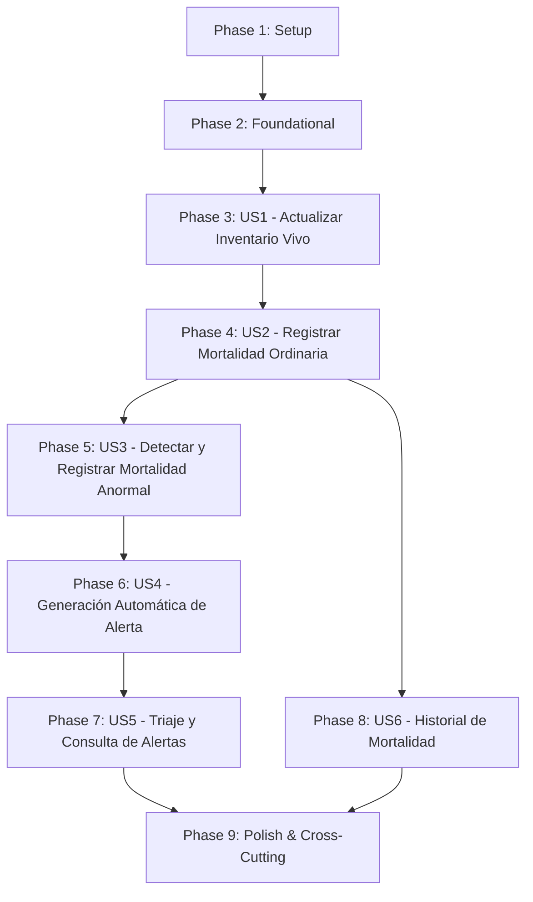

# Implementation Plan: Mortalidad, Alertas Sanitarias y Actualización del Inventario Vivo

**Date**: 04/10/2026

**Arquitectura y tecnologías**: [General.md](General.md)

**Specs**:

- [016-RegistrarMortalidadPorGalpon.md](../specs/016-RegistrarMortalidadPorGalpon.md)
- [017-RegistrarMortalidadAnormal.md](../specs/017-RegistrarMortalidadAnormal.md)
- [018-GenerarAlertaSanitaria.md](../specs/018-GenerarAlertaSanitaria.md)
- [019-ActualizarInventarioVivoPorGalpon.md](../specs/019-ActualizarInventarioVivoPorGalpon.md)

## Summary

Implementar el registro formal de mortalidad por galpón, la actualización atómica y exacta del inventario biológico vivo del lote activo, la detección y registro de eventos de mortalidad anormal basada en umbrales porcentuales diarios y severidad clínica, y la generación reactiva automática de alertas sanitarias con consolidación de contexto para la atención del equipo veterinario.

El plan asegura la integridad del inventario de aves vivas en granja: registrar una baja descuenta de forma síncrona e irreversible la población actual del lote dentro de la misma transacción local, protegiendo la inmutabilidad de la población inicial y evitando saldos negativos. Cuando la cantidad de bajas supera el umbral diario permitido o responde a causas críticas atípicas, el sistema dimensiona el impacto mediante el cálculo automático del porcentaje de mortalidad y nivel de severidad, registrando el evento anormal y originando una alerta sanitaria dirigida de forma exclusiva al veterinario con estado pendiente de atención.

`Galpon` y `Lote` continúan siendo entidades propietarias del Módulo 1. Este plan consume su información vigente a través de puertos de consulta y solicita la mutación del saldo de aves vivas mediante el puerto de actualización de inventario vivo, sin crear tablas paralelas ni copias autoritativas de dichas entidades. Todos los registros de mortalidad y alertas confirmadas son inmutables. El diagnóstico clínico, los tratamientos médicos, el aislamiento formal y la orden de sacrificio sanitario no pertenecen a este plan y se delegan a sus capacidades sanitarias respectivas mediante eventos y puertos.

## Technical Context

**Integraciones específicas**: Actualización de inventario vivo del Módulo 1 (`ActualizarInventarioVivoPort`); consultas de existencia y estado operativo de galpones y lotes (`GalponQueryPort`, `LoteQueryPort`); eventos internos de dominio con Spring Modulith; publicación de eventos de integración hacia Kafka para Módulo 3 y sistemas analíticos.

**Datos propios**: Registros de mortalidad ordinaria, registros de eventos de mortalidad anormal y alertas sanitarias emitidas para atención veterinaria.

**Performance Goals**:
- El 95 % de los registros de mortalidad (incluyendo la deducción atómica de inventario vivo) se confirma y persiste en máximo 1 segundo.
- La evaluación de umbrales y generación automática de la alerta sanitaria se completa en máximo 2 segundos desde la confirmación de la baja anormal.
- El 95 % de las consultas de historial de mortalidad y de la bandeja de triaje de alertas sanitarias responde en máximo 1 segundo.

**Constraints**:
- Transaccionalidad atómica estricta: un registro de bajas debe confirmar simultáneamente el evento de mortalidad y la reducción de la población actual del lote; si el descuento falla o la cantidad supera las aves vivas, la transacción se revierte en su totalidad.
- Invariante de inventario biológico: la población actual nunca puede ser negativa (`poblacionActual >= 0`). La población inicial del lote es estrictamente inmutable.
- Inmutabilidad de trazabilidad: una vez confirmados, los registros de mortalidad (ordinaria o anormal) y las alertas sanitarias no admiten edición (`PUT`/`PATCH`) ni eliminación (`DELETE`).
- Autorización por rol: el registro de mortalidad y de mortalidad anormal está habilitado exclusivamente para `ROLE_TRABAJADOR` y `ROLE_ADMINISTRADOR`. La consulta, triaje y atención de alertas sanitarias está restringida a `ROLE_VETERINARIO` y `ROLE_ADMINISTRADOR`.
- Reglas temporales: la fecha y hora del evento no pueden ser posteriores al instante actual del sistema (`Clock` en UTC / zona `America/Bogota`), ni anteriores a la fecha de ingreso del lote activo.
- Ausencia de asignaciones: cualquier trabajador autenticado puede registrar mortalidad en cualquier galpón que cuente con un lote activo y estado operativo productivo. No existen asignaciones de exclusividad entre trabajadores y galpones.
- Estado del galpón: no se permite registrar bajas ni mortalidad anormal en galpones sin lote activo o en estados no productivos (`DISPONIBLE`, `VACIADO_SANITARIO`, `MANTENIMIENTO`).

**Scale/Scope**: Seis historias de usuario, cinco endpoints REST, tres entidades de dominio con sus Value Objects y Enums, puertos de persistencia y de integración, eventos de dominio internos y publicación de eventos de integración.

**Dependencias funcionales**:
- Consulta de galpones y lotes del Módulo 1 (reutilizando contratos de [001-ConsultaYSeguimientoDeGalpones.md](001-ConsultaYSeguimientoDeGalpones.md)).
- Mutación autoritativa de la población del lote activo en Módulo 1.
- Recepción de alertas por parte de las capacidades de diagnóstico, aislamiento y sacrificio ([005-GestionDeEnfermedadesAislamientoYDiagnostico.md](005-GestionDeEnfermedadesAislamientoYDiagnostico.md) y Plan 008).
- Auditoría, actor autenticado, reloj compartido y formato de errores definidos en [General.md](General.md).

### Decisiones específicas

1. **Agregados y Entidades Propias**:
   - `RegistroMortalidad`: Entidad de negocio que documenta el evento ordinario de bajas con UUID, `galponId`, `loteId`, `fechaHoraEvento`, `fechaHoraRegistro`, `cantidadMuertes`, `causa`, `observaciones`, `esAnormal` y `registradoPor`.
   - `RegistroMortalidadAnormal`: Entidad que captura la novedad crítica con UUID, referencia al `registroMortalidadId`, `porcentajeMortalidad`, `nivelSeveridad`, `causaProbable`, `poblacionVivaMomento` y observaciones complementarias.
   - `AlertaSanitaria`: Entidad de notificación clínica con UUID, `fechaHoraEmision`, `nivelPrioridad`, `estado` (`PENDIENTE_ATENCION_VETERINARIA`), `registroMortalidadAnormalId`, `galponId`, `loteId` y destinatario (`ROLE_VETERINARIO`).
2. **Descuento Atómico de Inventario Vivo (Spec 019)**:
   La actualización del inventario vivo no es un proceso en segundo plano ni eventual; es un caso de uso incluido (`<<include>>`) obligatorio que se ejecuta dentro del límite transaccional local del registro de mortalidad mediante `ActualizarInventarioVivoPort`. Si la cantidad de muertes supera la población viva actual reportada en base de datos bajo bloqueo, la transacción se aborta con error de negocio `409 Conflict`.
3. **Manejo de Concurrencia**:
   Para evitar inconsistencias en el saldo vivo ante registros simultáneos de bajas en un mismo lote, el puerto de inventario vivo implementa bloqueo pesimista en lectura (`PESSIMISTIC_WRITE`) o control estricto de concurrencia optimista (`@Version`) sobre el registro de población viva.
4. **Fórmula y Precisión del Porcentaje de Mortalidad**:
   El cálculo se define formalmente como:
   $$\text{porcentajeMortalidad} = \left(\frac{\text{cantidadMuertes}}{\text{poblacionActualAnterior}}\right) \times 100$$
   Se ejecuta utilizando `BigDecimal` con escala de 2 decimales y redondeo `RoundingMode.HALF_UP`.
5. **Algoritmo de Detección de Mortalidad Anormal y Niveles de Severidad**:
   - Umbral diario normal: valor porcentual parametrizable a nivel de lote/granja, establecido por defecto en `0.10 %` de la población viva actual.
   - Superación de umbral: si `porcentajeMortalidad > 0.10 %`, el sistema marca automáticamente el registro como anormal y dispara la alerta sanitaria.
   - Clasificación de severidad y prioridad:
     - `ALTA`: Porcentaje entre `0.10 %` y `1.00 %`, o reporte de causa infecciosa/atípica con baja moderada.
     - `CRITICA`: Porcentaje entre `1.01 %` y `5.00 %`, o sospecha de patología de notificación oficial inmediata.
     - `EMERGENCIA_SANITARIA`: Porcentaje superior a `5.00 %` o mortalidad que extingue el lote (`poblacionActual = 0`).
6. **Lote Activo del Galpón**:
   El lote activo se determina consultando `LoteQueryPort`. El criterio formal es la asociación vigente identificada por el Módulo 1 (lote actualmente alojado con fecha de ingreso más reciente en estado activo). Si el galpón no cuenta con lote activo, la operación es rechazada de inmediato.
7. **Inmutabilidad y No Eliminación**:
   Ningún endpoint expone verbos `PUT`, `PATCH` ni `DELETE` sobre registros de mortalidad o alertas sanitarias. Cualquier error de digitación u omisión debe gestionarse mediante auditoría y eventos compensatorios en fases posteriores acordadas, nunca modificando registros confirmados.
8. **Consolidación de Contexto para el Veterinario (Triaje)**:
   La consulta de alertas (`GET /api/alertas-sanitarias/{alertaId}`) ensambla en la capa de aplicación el detalle del galpón (nombre, aforo, estado), lote (nombre, población viva actual, edad en días calculada) y del evento de mortalidad anormal (porcentaje, severidad, bajas, causa sospechosa, notas y usuario que reportó) en una respuesta unificada para permitir la toma de decisiones clínicas inmediatas.
9. **Eventos Internos (Spring Modulith)**:
   Toda confirmación exitosa publica eventos internos:
   - `MortalidadRegistradaEvent`
   - `InventarioVivoActualizadoEvent`
   - `MortalidadAnormalRegistradaEvent` (cuando aplique)
   - `AlertaSanitariaGeneradaEvent` (cuando aplique)
10. **Eventos de Integración (Apache Kafka)**:
    Se implementa el patrón Outbox transaccional para publicar a Kafka contratos versionados:
    - `AviControl.InventarioVivo.MortalidadConfirmada.v1`: consumido por Módulo 3 para costeo de mermas y proyecciones biológicas.
    - `AviControl.Sanitario.AlertaSanitariaGenerada.v1`: consumido por servicios de mensajería y notificaciones push hacia el personal veterinario.
11. **Modelo de Persistencia**:
    Flyway versionará las tablas `mortalidad_registro`, `mortalidad_anormal` y `alerta_sanitaria`. No se crean tablas duplicadas para `galpon` ni `lote`; únicamente se persisten sus claves foráneas lógicas (`UUID`).
12. **Manejo del Tiempo**:
    Las fechas y horas del evento ingresadas por el usuario se procesan como `LocalDateTime` en la zona horaria del negocio (`America/Bogota`). El momento de persistencia y auditoría (`fechaHoraRegistro`, `fechaHoraEmision`) se obtiene a través de la abstracción `Clock` compartida en formato UTC (`Instant`).
13. **Validación Sintáctica y Semántica**:
    - Sintáctica: Jakarta Bean Validation en DTOs (`@NotNull`, `@Positive`, `@Size`, etc.).
    - Semántica: En entidades de dominio y casos de uso (bajas <= población viva actual, fecha no futura, coherencia de lote activo).
14. **Formato RFC 9457**:
    Todas las respuestas de excepción devuelven `application/problem+json` con campos estables `type`, `title`, `status`, `detail`, `instance`, `code`, `correlationId` y `fieldErrors`.

### Alcance documental

- La validación formal de aislamiento, diagnóstico clínico y prescripción médica pertenecen a [005-GestionDeEnfermedadesAislamientoYDiagnostico.md](005-GestionDeEnfermedadesAislamientoYDiagnostico.md) y [006-GestionDeMedicamentosYConsumoDeMedicamentos.md](006-GestionDeMedicamentosYConsumoDeMedicamentos.md). La alerta sanitaria nace en estado `PENDIENTE_ATENCION_VETERINARIA` y sirve como insumo de entrada para dichos planes.
- La emisión y ejecución de órdenes de sacrificio sanitario pertenecen al Plan 008. Si un evento genera `EMERGENCIA_SANITARIA`, este plan solo documenta la alerta y publica el hecho.
- La salida de aves por concepto de cosecha productiva o venta comercial corresponde al Plan 009.
- El cálculo de liquidación económica o costos por merma biológica corresponde al Módulo 3.

## Project Structure

### Documentation (this feature)

```text
docs/
├── specs/
│   ├── 016-RegistrarMortalidadPorGalpon.md
│   ├── 017-RegistrarMortalidadAnormal.md
│   ├── 018-GenerarAlertaSanitaria.md
│   └── 019-ActualizarInventarioVivoPorGalpon.md
└── plan/
    └── 007-MortalidadAlertasSanitariasYActualizacionDelInventarioVivo.md
```

### Source Code (repository root)

```text
src/main/java/com/avicontrol/
├── domain/
│   ├── model/
│   │   ├── mortalidad/
│   │   │   ├── RegistroMortalidad.java
│   │   │   ├── RegistroMortalidadAnormal.java
│   │   │   ├── CausaMortalidad.java
│   │   │   └── NivelSeveridad.java
│   │   └── alerta/
│   │       ├── AlertaSanitaria.java
│   │       ├── PrioridadAlerta.java
│   │       └── EstadoAlertaSanitaria.java
│   ├── event/
│   │   ├── MortalidadRegistradaEvent.java
│   │   ├── MortalidadAnormalRegistradaEvent.java
│   │   ├── AlertaSanitariaGeneradaEvent.java
│   │   └── InventarioVivoActualizadoEvent.java
│   ├── exception/mortalidad/
│   │   ├── MortalidadInvalidaException.java
│   │   ├── PoblacionInsuficienteException.java
│   │   ├── GalponSinLoteActivoException.java
│   │   ├── GalponNoProductivoException.java
│   │   ├── FechaEventoInvalidaException.java
│   │   └── AlertaSanitariaNoEncontradaException.java
│   └── port/out/
│       ├── mortalidad/
│       │   ├── RegistroMortalidadRepositoryPort.java
│       │   └── RegistroMortalidadAnormalRepositoryPort.java
│       ├── alerta/
│       │   └── AlertaSanitariaRepositoryPort.java
│       └── integration/
│           ├── ActualizarInventarioVivoPort.java
│           ├── GalponQueryPort.java
│           ├── LoteQueryPort.java
│           └── IntegrationEventPublisherPort.java
├── application/
│   ├── mortalidad/
│   │   ├── RegistrarMortalidadUseCase.java
│   │   ├── RegistrarMortalidadAnormalUseCase.java
│   │   ├── ConsultarHistorialMortalidadUseCase.java
│   │   ├── command/
│   │   │   ├── RegistrarMortalidadCommand.java
│   │   │   └── RegistrarMortalidadAnormalCommand.java
│   │   └── result/
│   │       ├── RegistroMortalidadResult.java
│   │       ├── RegistroMortalidadAnormalResult.java
│   │       └── HistorialMortalidadResult.java
│   ├── alerta/
│   │   ├── GenerarAlertaSanitariaUseCase.java
│   │   ├── ConsultarAlertasSanitariasUseCase.java
│   │   ├── ConsultarDetalleAlertaSanitariaUseCase.java
│   │   └── result/
│   │       ├── AlertaSanitariaResumenResult.java
│   │       └── AlertaSanitariaDetalleResult.java
│   └── inventario/
│       └── ActualizarInventarioVivoUseCase.java
└── infrastructure/
    ├── adapter/in/
    │   ├── rest/
    │   │   ├── mortalidad/
    │   │   │   ├── MortalidadController.java
    │   │   │   ├── dto/
    │   │   │   │   ├── RegistrarMortalidadRequest.java
    │   │   │   │   ├── RegistrarMortalidadAnormalRequest.java
    │   │   │   │   ├── RegistroMortalidadResponse.java
    │   │   │   │   ├── RegistroMortalidadAnormalResponse.java
    │   │   │   │   └── HistorialMortalidadResponse.java
    │   │   │   └── mapper/MortalidadRestMapper.java
    │   │   └── alerta/
    │   │       ├── AlertaSanitariaController.java
    │   │       ├── dto/
    │   │       │   ├── AlertaSanitariaResumenResponse.java
    │   │       │   └── AlertaSanitariaDetalleResponse.java
    │   │       └── mapper/AlertaSanitariaRestMapper.java
    │   └── event/
    │       └── MortalidadEventListener.java
    ├── adapter/out/
    │   ├── persistence/
    │   │   ├── mortalidad/
    │   │   │   ├── entity/
    │   │   │   │   ├── RegistroMortalidadEntity.java
    │   │   │   │   └── RegistroMortalidadAnormalEntity.java
    │   │   │   ├── repository/
    │   │   │   │   ├── SpringDataRegistroMortalidadRepository.java
    │   │   │   │   └── SpringDataRegistroMortalidadAnormalRepository.java
    │   │   │   ├── mapper/MortalidadPersistenceMapper.java
    │   │   │   └── RegistroMortalidadPersistenceAdapter.java
    │   │   └── alerta/
    │   │       ├── entity/AlertaSanitariaEntity.java
    │   │       ├── repository/SpringDataAlertaSanitariaRepository.java
    │   │       ├── mapper/AlertaSanitariaPersistenceMapper.java
    │   │       └── AlertaSanitariaPersistenceAdapter.java
    │   └── internal/
    │       ├── Modulo1ActualizarInventarioVivoAdapter.java
    │       ├── Modulo1GalponQueryAdapter.java
    │       └── Modulo1LoteQueryAdapter.java
    └── config/
        └── MortalidadBeanConfiguration.java

src/test/java/com/avicontrol/
├── domain/model/
│   ├── mortalidad/
│   │   ├── RegistroMortalidadTest.java
│   │   └── RegistroMortalidadAnormalTest.java
│   └── alerta/
│       └── AlertaSanitariaTest.java
├── application/
│   ├── mortalidad/
│   │   ├── RegistrarMortalidadUseCaseTest.java
│   │   ├── RegistrarMortalidadAnormalUseCaseTest.java
│   │   └── ConsultarHistorialMortalidadUseCaseTest.java
│   ├── alerta/
│   │   ├── GenerarAlertaSanitariaUseCaseTest.java
│   │   ├── ConsultarAlertasSanitariasUseCaseTest.java
│   │   └── ConsultarDetalleAlertaSanitariaUseCaseTest.java
│   └── inventario/
│       └── ActualizarInventarioVivoUseCaseTest.java
└── infrastructure/
    ├── adapter/in/rest/
    │   ├── MortalidadControllerTest.java
    │   └── AlertaSanitariaControllerTest.java
    ├── adapter/out/persistence/
    │   ├── RegistroMortalidadPersistenceAdapterTest.java
    │   └── AlertaSanitariaPersistenceAdapterTest.java
    └── integration/
        ├── MortalidadInventarioIntegrationTest.java
        └── AlertaSanitariaFlowIntegrationTest.java
```

**Structure Decision**: Arquitectura hexagonal modular en Java 21 / Spring Boot 4. Dominio puro sin anotaciones de JPA, Jackson ni Spring; casos de uso organizados como servicios de aplicación que coordinan las reglas de negocio; adaptadores desacoplados para REST, persistencia relacional con PostgreSQL / Flyway, e integración con Módulo 1 y Kafka.

### Entidades y relación

```text
RegistroMortalidad (Agregado Base)
├── id: UUID
├── galponId: UUID
├── loteId: UUID
├── fechaHoraEvento: LocalDateTime
├── fechaHoraRegistro: Instant
├── cantidadMuertes: Integer (> 0)
├── causa: CausaMortalidad
├── observaciones: String (opcional)
├── esAnormal: boolean
└── registradoPor: UUID

RegistroMortalidadAnormal (Extensión Crítica 1:1)
├── id: UUID
├── registroMortalidadId: UUID
├── galponId: UUID
├── loteId: UUID
├── cantidadMuertes: Integer
├── poblacionVivaMomento: Integer
├── porcentajeMortalidad: BigDecimal (escala 2)
├── causaProbable: String
├── nivelSeveridad: NivelSeveridad (ALTA, CRITICA, EMERGENCIA_SANITARIA)
├── observaciones: String
├── fechaHoraEvento: LocalDateTime
├── fechaHoraRegistro: Instant
└── registradoPor: UUID

AlertaSanitaria (Agregado Notificación Veterinaria)
├── id: UUID
├── fechaHoraEmision: Instant
├── nivelPrioridad: PrioridadAlerta (ALTA, CRITICA, EMERGENCIA_SANITARIA)
├── estado: EstadoAlertaSanitaria (PENDIENTE_ATENCION_VETERINARIA)
├── registroMortalidadAnormalId: UUID
├── galponId: UUID
├── loteId: UUID
└── destinatarioRol: String ("ROLE_VETERINARIO")
```

Relaciones:
- Un `RegistroMortalidad` siempre descuenta `cantidadMuertes` de la `poblacionActual` del `Lote` activo en Módulo 1.
- Si el porcentaje de bajas supera el umbral o el operario reporta anomalía, se genera un `RegistroMortalidadAnormal` vinculado al `RegistroMortalidad`.
- La confirmación de un `RegistroMortalidadAnormal` genera de forma inmediata y automática una `AlertaSanitaria` en estado `PENDIENTE_ATENCION_VETERINARIA`.

### Contratos de los puertos

| Puerto | Tipo | Responsabilidad |
| --- | --- | --- |
| `RegistroMortalidadRepositoryPort` | Salida (Persistencia) | Almacenar registros inmutables de mortalidad ordinaria y consultar historial paginado por galpón y lote. |
| `RegistroMortalidadAnormalRepositoryPort` | Salida (Persistencia) | Almacenar registros inmutables de eventos de mortalidad anormal con cálculos de severidad. |
| `AlertaSanitariaRepositoryPort` | Salida (Persistencia) | Almacenar alertas sanitarias inmutables, consultar bandeja pendiente y obtener detalle consolidado por UUID. |
| `ActualizarInventarioVivoPort` | Salida (Integración Módulo 1) | Ejecutar la deducción atómica de aves vivas (`poblacionActual - bajas`) sobre el lote activo bajo bloqueo. |
| `GalponQueryPort` | Salida (Integración Módulo 1) | Consultar existencia, nombre, aforo y estado operativo del galpón. |
| `LoteQueryPort` | Salida (Integración Módulo 1) | Consultar lote activo alojado, población actual, fecha de ingreso y edad en días. |
| `IntegrationEventPublisherPort` | Salida (Eventos Externos) | Publicar eventos de integración versionados a Apache Kafka mediante el outbox pattern. |

### Contratos HTTP propuestos

| Endpoint | Verbo | Acceso | Propósito |
| --- | --- | --- | --- |
| `/api/galpones/{galponId}/mortalidad` | POST | `ROLE_TRABAJADOR`, `ROLE_ADMINISTRADOR` | Registrar evento diario de bajas, descontar inventario vivo y evaluar anomalía. |
| `/api/galpones/{galponId}/mortalidad-anormal` | POST | `ROLE_TRABAJADOR`, `ROLE_ADMINISTRADOR` | Registrar reporte explícito de mortalidad crítica, descontar inventario y emitir alerta. |
| `/api/galpones/{galponId}/mortalidad` | GET | `ROLE_TRABAJADOR`, `ROLE_ADMINISTRADOR`, `ROLE_VETERINARIO` | Consultar historial paginado de bajas del galpón y lote activo. |
| `/api/alertas-sanitarias` | GET | `ROLE_VETERINARIO`, `ROLE_ADMINISTRADOR` | Consultar bandeja de alertas sanitarias pendientes para triaje veterinario. |
| `/api/alertas-sanitarias/{alertaId}` | GET | `ROLE_VETERINARIO`, `ROLE_ADMINISTRADOR` | Consultar detalle contextual consolidado de una alerta sanitaria específica. |

### JSON común de errores

En cumplimiento con RFC 9457 y [General.md](General.md), todas las respuestas de error utilizan `Content-Type: application/problem+json`:

```json
{
  "type": "https://avicontrol/errors/poblacion-insuficiente",
  "title": "Conflicto en actualización de inventario vivo",
  "status": 409,
  "detail": "La cantidad de bajas ingresada (60) supera la población viva actual del lote (50)",
  "instance": "/api/galpones/550e8400-e29b-41d4-a716-446655440001/mortalidad",
  "code": "POBLACION_INSUFICIENTE",
  "correlationId": "d3b07384-d113-4a1a-bb02-995b058c672b",
  "fieldErrors": [
    {
      "field": "cantidadMuertes",
      "code": "EXCEDE_POBLACION_ACTUAL",
      "message": "La cantidad no puede superar las 50 aves vivas disponibles"
    }
  ]
}
```

---

## Phase 1: Setup (Shared Infrastructure)

**Purpose**: Preparar las configuraciones iniciales, contratos de integración y fixtures del feature.

- [ ] T001 Revisar y contrastar las interfaces públicas expuestas por el Módulo 1 para la consulta de galpones y lotes (`GalponQueryPort`, `LoteQueryPort`), verificando que incluyan estado del galpón, población actual y fecha de ingreso del lote.
- [ ] T002 Definir el contrato del puerto `ActualizarInventarioVivoPort` para la deducción atómica de población viva con manejo de excepciones por saldo insuficiente o bloqueo.
- [ ] T003 Configurar roles y autorizaciones de seguridad en Spring Security para los endpoints de mortalidad (`ROLE_TRABAJADOR`, `ROLE_ADMINISTRADOR`) y alertas sanitarias (`ROLE_VETERINARIO`, `ROLE_ADMINISTRADOR`).
- [ ] T004 Crear fixtures y datos de prueba para galpones productivos con lotes activos, lotes con saldos límite (1, 25, 50 y 5.000 aves), galpones en estados no permitidos (`DISPONIBLE`, `VACIADO_SANITARIO`) y galpones sin lote alojado.

**Checkpoint**: Entorno de desarrollo y contratos de integración con Módulo 1 verificados sin ambigüedades.

---

## Phase 2: Foundational (Blocking Prerequisites)

**Purpose**: Construir los agregados de dominio, objetos de valor, entidades JPA, migraciones Flyway y puertos base.

- [ ] T005 Implementar en Java puro las entidades de dominio `RegistroMortalidad`, `RegistroMortalidadAnormal`, `AlertaSanitaria`, el Value Object `CausaMortalidad` y los Enums `NivelSeveridad`, `PrioridadAlerta` y `EstadoAlertaSanitaria`.
- [ ] T006 Implementar en el modelo de dominio las validaciones de invariantes: `cantidadMuertes > 0`, fecha/hora no futura respecto al `Clock`, fecha/hora posterior al ingreso del lote y cálculo matemático exacto del porcentaje de mortalidad mediante `BigDecimal`.
- [ ] T007 Definir las excepciones de negocio del paquete `com.avicontrol.domain.exception.mortalidad`: `PoblacionInsuficienteException`, `GalponSinLoteActivoException`, `GalponNoProductivoException`, `FechaEventoInvalidaException` y `AlertaSanitariaNoEncontradaException`.
- [ ] T008 Definir las interfaces de salida `RegistroMortalidadRepositoryPort`, `RegistroMortalidadAnormalRepositoryPort`, `AlertaSanitariaRepositoryPort` y `ActualizarInventarioVivoPort`.
- [ ] T009 Crear la migración Flyway (`V7__create_mortalidad_y_alertas_tables.sql`) creando las tablas `mortalidad_registro`, `mortalidad_anormal` y `alerta_sanitaria` con sus índices por `galpon_id`, `lote_id`, `fecha_hora_evento`, `estado` y llaves foráneas lógicas.
- [ ] T010 Implementar las entidades JPA (`RegistroMortalidadEntity`, `RegistroMortalidadAnormalEntity`, `AlertaSanitariaEntity`), los repositorios Spring Data y los mappers bidireccionales de persistencia.
- [ ] T011 Configurar la composición de beans en `MortalidadBeanConfiguration` vinculando adaptadores con casos de uso y asegurando el límite transaccional `@Transactional` en los casos de uso de escritura.

**Checkpoint**: Base de dominio y persistencia lista para soportar la ejecución independiente de las historias de usuario.

---

## Phase 3: User Story 1 — Actualizar Población Actual e Inventario Vivo por Bajas (Priority: P1)

**Spec**: [019-ActualizarInventarioVivoPorGalpon.md](../specs/019-ActualizarInventarioVivoPorGalpon.md), historia 1.

**Goal**: Garantizar la actualización atómica y exacta del atributo `poblacionActual` en el lote activo ante bajas confirmadas, salvaguardando la inmutabilidad de `poblacionInicial`, impidiendo valores negativos y bloqueando condiciones de carrera.

**Independent Test**: Invocar la deducción de 40 bajas sobre un lote con 8.000 aves vivas; verificar que `poblacionActual` resulte exactamente en 7.960 aves y que `poblacionInicial` permanezca en 8.000. Intentar deducir 60 bajas sobre un lote con 50 aves y verificar el rechazo íntegro de la transacción sin alterar el saldo previo.

### Definición del evento para User Story 1

**Evento producido**: `InventarioVivoActualizadoEvent`
- Atributos: `eventId`, `loteId`, `galponId`, `poblacionAnterior`, `cantidadDescontada`, `poblacionActualizada`, `occurredAt`, `correlationId`.

**Evento consumido**: Ninguno (es una invocación síncrona transaccional incluida por el caso de uso de registro de mortalidad).

### Tests para User Story 1

- [ ] T012 [P] [US1] Unit test en `ActualizarInventarioVivoUseCaseTest`: validar descuento matemático exacto, rechazo ante bajas <= 0, rechazo si bajas > población actual, y reducción a exactamente 0 aves sin permitir números negativos.
- [ ] T013 [P] [US1] Unit test de inmutabilidad: verificar que bajo ninguna circunstancia se altere el campo `poblacionInicial` del lote.
- [ ] T014 [US1] Integration test con Testcontainers: probar concurrencia de dos descuentos simultáneos sobre el mismo lote activo, asegurando serialización estricta sin inconsistencias de saldo.

### Implementación para User Story 1

- [ ] T015 [P] [US1] Implementar el caso de uso `ActualizarInventarioVivoUseCase` orquestando la lectura con bloqueo del lote activo y validación de saldo.
- [ ] T016 [US1] Implementar `Modulo1ActualizarInventarioVivoAdapter` consumiendo la interfaz autoritativa del Módulo 1 y traduciendo excepciones de concurrencia o saldo.
- [ ] T017 [US1] Publicar el evento interno `InventarioVivoActualizadoEvent` tras confirmarse el descuento exitoso.

**Checkpoint**: Capacidad de descuento biológico operativa, atómica y blindada contra saldos negativos.

---

## Phase 4: User Story 2 — Registrar Mortalidad Ordinaria por Galpón (Priority: P1)

**Spec**: [016-RegistrarMortalidadPorGalpon.md](../specs/016-RegistrarMortalidadPorGalpon.md), historia 1.

**Goal**: El trabajador u operario registra las bajas diarias de aves en un galpón con lote activo (fecha/hora evento, causa, cantidad y notas opcionales), almacenando el registro inmutable y descontando atómicamente el inventario vivo.

**Independent Test**: Seleccionar un galpón con lote activo de 5.000 aves, registrar 5 bajas por "Calor / Asfixia" con fecha/hora válida; verificar la persistencia de la mortalidad, la deducción a 4.995 aves vivas y respuesta HTTP 201 Created.

### Definición del evento para User Story 2

**Evento producido**: `MortalidadRegistradaEvent`
- Atributos: `eventId`, `mortalidadId`, `galponId`, `loteId`, `cantidadMuertes`, `causa`, `fechaHoraEvento`, `registradoPor`, `occurredAt`.

**Evento de integración (Kafka)**: `AviControl.InventarioVivo.MortalidadConfirmada.v1`
- Payload: `mortalidadId`, `galponId`, `loteId`, `cantidadMuertes`, `causa`, `fechaHoraEvento`, `poblacionRestante`.

### Definición del endpoint REST para User Story 2

| Elemento | Definición |
| --- | --- |
| Método y ruta | `POST /api/galpones/{galponId}/mortalidad` |
| Autorización | `ROLE_TRABAJADOR`, `ROLE_ADMINISTRADOR` |
| Entrada (Path) | `galponId` (UUID obligatorio) |
| Entrada (Body) | `fechaHoraEvento` (ISO-8601), `cantidadMuertes` (int > 0), `causa` (String no vacío), `observaciones` (String opcional) |
| Respuesta 201 | Objeto `RegistroMortalidadResponse` con ID, datos guardados, población viva restante y `esAnormal: false` |
| Errores | 400 por campos faltantes o cantidad <= 0; 401 sin autenticación; 403 sin rol; 404 si el galpón o lote no existen; 409 si el galpón no está en estado productivo, fecha posterior a la actual, fecha anterior al ingreso, o bajas > población actual; 503 por indisponibilidad de Módulo 1 |

#### JSON de solicitud (Request)

```json
{
  "fechaHoraEvento": "2026-09-19T07:15:00",
  "cantidadMuertes": 4,
  "causa": "Problemas digestivos / entéricos",
  "observaciones": "Retiradas en recorrido matutino de inspección."
}
```

#### JSON de respuesta exitosa (Response 201)

```json
{
  "id": "7c9e6679-7425-40de-944b-e07fc1f90ae7",
  "galponId": "550e8400-e29b-41d4-a716-446655440001",
  "loteId": "2fc03a21-84c4-4c83-bb15-6607bb75cb90",
  "fechaHoraEvento": "2026-09-19T07:15:00",
  "fechaHoraRegistro": "2026-09-19T12:15:30Z",
  "cantidadMuertes": 4,
  "causa": "Problemas digestivos / entéricos",
  "observaciones": "Retiradas en recorrido matutino de inspección.",
  "poblacionRestante": 4996,
  "esAnormal": false,
  "registradoPor": "a1b2c3d4-e5f6-7a8b-9c0d-1e2f3a4b5c6d"
}
```

### Tests para User Story 2

- [ ] T018 [P] [US2] Unit test en `RegistrarMortalidadUseCaseTest`: verificar validación de galpón con lote activo, rechazo ante galpón sin lote o en estado no productivo, validación temporal y coordinación transaccional con `ActualizarInventarioVivoPort`.
- [ ] T019 [P] [US2] Contract test en `MortalidadControllerTest`: probar peticiones válidas con rol trabajador, rechazo a usuarios no autorizados, validación de DTO de entrada y serialización de `RegistroMortalidadResponse`.
- [ ] T020 [US2] Probar escenarios de rechazo (bajas > población actual, fecha futura, galpón inexistente) verificando respuestas RFC 9457 con código `409` y `404`.

### Implementación para User Story 2

- [ ] T021 [P] [US2] Crear DTOs de entrada/salida `RegistrarMortalidadRequest`, `RegistroMortalidadResponse` y mapper `MortalidadRestMapper`.
- [ ] T022 [P] [US2] Implementar `RegistrarMortalidadUseCase` validando galpón/lote, ejecutando deducción de inventario, persistiendo en `RegistroMortalidadRepositoryPort` y publicando eventos.
- [ ] T023 [US2] Implementar el endpoint `POST /api/galpones/{galponId}/mortalidad` en `MortalidadController` inyectando actor autenticado.
- [ ] T024 [US2] Implementar adaptador de persistencia `RegistroMortalidadPersistenceAdapter` garantizando inmutabilidad.

**Checkpoint**: Registro formal de mortalidad ordinaria funcionando con actualización atómica de existencias vivas.

---

## Phase 5: User Story 3 — Detectar y Registrar Mortalidad Anormal con Cálculo de Severidad (Priority: P1)

**Specs**: [016-RegistrarMortalidadPorGalpon.md](../specs/016-RegistrarMortalidadPorGalpon.md) (historia 2), [017-RegistrarMortalidadAnormal.md](../specs/017-RegistrarMortalidadAnormal.md) (historias 1 y 2).

**Goal**: El sistema evalúa automáticamente si las bajas superan el umbral diario (0.10 % de la población viva), o permite al trabajador reportar directamente una emergencia atípica; calcula exactamente el porcentaje de mortalidad respecto a las aves vivas, asigna el nivel de severidad (`ALTA`, `CRITICA`, `EMERGENCIA_SANITARIA`), persiste el registro inmutable y activa la extensión hacia alerta sanitaria.

**Independent Test**: En un lote de 5.000 aves con umbral de 5 aves/jornada, registrar 18 bajas; verificar que el sistema calcule 0.36 % de mortalidad, clasifique el evento como severidad `ALTA`, almacene `RegistroMortalidadAnormal` y active el caso de uso de alerta sanitaria.

### Definición del evento para User Story 3

**Evento producido**: `MortalidadAnormalRegistradaEvent`
- Atributos: `eventId`, `mortalidadAnormalId`, `registroMortalidadId`, `galponId`, `loteId`, `cantidadMuertes`, `porcentajeMortalidad`, `nivelSeveridad`, `causaProbable`, `occurredAt`.

### Definición del endpoint REST para User Story 3

| Elemento | Definición |
| --- | --- |
| Método y ruta | `POST /api/galpones/{galponId}/mortalidad-anormal` |
| Autorización | `ROLE_TRABAJADOR`, `ROLE_ADMINISTRADOR` |
| Entrada (Path) | `galponId` (UUID obligatorio) |
| Entrada (Body) | `fechaHoraEvento` (ISO-8601), `cantidadMuertes` (int > 0), `causaProbable` (String obligatorio), `observaciones` (String obligatorio) |
| Respuesta 201 | Objeto `RegistroMortalidadAnormalResponse` con ID, porcentaje calculado, severidad, alerta sanitaria asociada y población restante |
| Errores | 400 por campos faltantes o causa omitida; 401/403 por seguridad; 404 si el galpón o lote no existen; 409 si el galpón no está en estado `PRODUCTIVO` o bajas > población actual |

#### JSON de solicitud (Request)

```json
{
  "fechaHoraEvento": "2026-09-19T07:15:00",
  "cantidadMuertes": 18,
  "causaProbable": "Problemas digestivos / entéricos",
  "observaciones": "Retiradas en recorrido matutino de inspección. Temperatura ambiente elevada en la madrugada (29°C)."
}
```

#### JSON de respuesta exitosa (Response 201)

```json
{
  "id": "e8f1b623-1122-48cd-b99d-8fbc923a1055",
  "registroMortalidadId": "7c9e6679-7425-40de-944b-e07fc1f90ae7",
  "galponId": "550e8400-e29b-41d4-a716-446655440001",
  "loteId": "2fc03a21-84c4-4c83-bb15-6607bb75cb90",
  "fechaHoraEvento": "2026-09-19T07:15:00",
  "fechaHoraRegistro": "2026-09-19T12:15:30Z",
  "cantidadMuertes": 18,
  "poblacionVivaMomento": 5000,
  "porcentajeMortalidad": 0.36,
  "nivelSeveridad": "ALTA",
  "causaProbable": "Problemas digestivos / entéricos",
  "observaciones": "Retiradas en recorrido matutino de inspección. Temperatura ambiente elevada en la madrugada (29°C).",
  "poblacionRestante": 4982,
  "alertaSanitariaId": "3fa85f64-5717-4562-b3fc-2c963f66afa6",
  "registradoPor": "a1b2c3d4-e5f6-7a8b-9c0d-1e2f3a4b5c6d"
}
```

### Tests para User Story 3

- [ ] T025 [P] [US3] Unit test en `RegistroMortalidadAnormalTest`: cálculo matemático de `(bajas / poblacion) * 100`, redondeo exacto con `BigDecimal` y reglas de mapeo de severidad (`ALTA`, `CRITICA`, `EMERGENCIA_SANITARIA`).
- [ ] T026 [P] [US3] Unit test en `RegistrarMortalidadUseCase`: probar detección automática cuando `POST /mortalidad` ordinario recibe una cantidad que excede el umbral configurado (ej. 18 bajas en lote de 5.000).
- [ ] T027 [P] [US3] Unit test en `RegistrarMortalidadAnormalUseCase`: probar endpoint explícito de emergencia, validando obligatoriedad de observaciones y causa probable.
- [ ] T028 [US3] Contract test en `MortalidadControllerTest` para `POST /api/galpones/{galponId}/mortalidad-anormal`.

### Implementación para User Story 3

- [ ] T029 [P] [US3] Implementar en el dominio el evaluador de umbrales diarios y el clasificador de severidad clínica.
- [ ] T030 [P] [US3] Implementar `RegistrarMortalidadAnormalUseCase` integrando descuento de inventario, persistencia en `RegistroMortalidadAnormalRepositoryPort` y detonación del caso de uso de alerta sanitaria.
- [ ] T031 [US3] Modificar `RegistrarMortalidadUseCase` ordinario para que evalúe el umbral y, ante superación, invoque la generación del registro anormal de forma transparente.
- [ ] T032 [US3] Implementar el endpoint `POST /api/galpones/{galponId}/mortalidad-anormal` en `MortalidadController`.

**Checkpoint**: Detección y registro de eventos anormales operando con cálculo exacto de porcentaje y severidad.

---

## Phase 6: User Story 4 — Generación Automática de Alerta Sanitaria para el Veterinario (Priority: P1)

**Spec**: [018-GenerarAlertaSanitaria.md](../specs/018-GenerarAlertaSanitaria.md), historia 1.

**Goal**: Generar automáticamente una alerta sanitaria inmutable tras confirmarse un registro de mortalidad anormal, fijando estado `PENDIENTE_ATENCION_VETERINARIA`, asignando prioridad según la severidad y dirigiéndola al rol `ROLE_VETERINARIO`.

**Independent Test**: Confirmar un registro de mortalidad anormal en un lote; verificar que el sistema genere una `AlertaSanitaria` vinculada a dicho registro con UUID propio, timestamp actual, prioridad acorde a la severidad y estado pendiente, sin permitir su cierre o edición durante la emisión.

### Definición del evento para User Story 4

**Evento producido**: `AlertaSanitariaGeneradaEvent`
- Atributos: `eventId`, `alertaId`, `galponId`, `loteId`, `registroMortalidadAnormalId`, `prioridad`, `estado`, `fechaHoraEmision`.

**Evento de integración (Kafka)**: `AviControl.Sanitario.AlertaSanitariaGenerada.v1`
- Payload: `alertaId`, `galponId`, `loteId`, `prioridad`, `porcentajeMortalidad`, `causaProbable`, `fechaHoraEmision`.

### Tests para User Story 4

- [ ] T033 [P] [US4] Unit test en `AlertaSanitariaTest`: creación de alerta, estado inicial obligatorio `PENDIENTE_ATENCION_VETERINARIA`, mapeo de severidad a prioridad (`ALTA`, `CRITICA`, `EMERGENCIA_SANITARIA`) e inmutabilidad.
- [ ] T034 [P] [US4] Unit test en `GenerarAlertaSanitariaUseCaseTest`: verificar generación inmediata dentro del flujo transaccional de mortalidad anormal y rechazo ante registros inválidos.
- [ ] T035 [US4] Integration test verificando que ante fallos en la emisión de la alerta se revierta el registro de mortalidad anormal para garantizar consistencia biológica.

### Implementación para User Story 4

- [ ] T036 [P] [US4] Implementar `GenerarAlertaSanitariaUseCase` orquestando la creación de la entidad `AlertaSanitaria` y persistencia en `AlertaSanitariaRepositoryPort`.
- [ ] T037 [US4] Implementar `AlertaSanitariaPersistenceAdapter` garantizando la inmutabilidad y almacenamiento del historial de alertas.
- [ ] T038 [US4] Configurar la publicación del evento interno `AlertaSanitariaGeneradaEvent` y el mensaje de integración a Kafka mediante outbox pattern.

**Checkpoint**: Alertas sanitarias generándose de forma 100 % automática ante cualquier mortalidad anormal confirmada.

---

## Phase 7: User Story 5 — Consolidación y Consulta de Alertas Sanitarias para el Veterinario (Priority: P2)

**Spec**: [018-GenerarAlertaSanitaria.md](../specs/018-GenerarAlertaSanitaria.md), historia 2.

**Goal**: El veterinario consulta su bandeja de alertas sanitarias pendientes y visualiza el detalle contextual consolidado de cada alerta (galpón, aforo, estado, lote, población viva actual, edad en días, porcentaje de mortalidad, causa y notas del operario) para priorizar el triaje y la visita a campo.

**Independent Test**: Un usuario autenticado con `ROLE_VETERINARIO` consulta `GET /api/alertas-sanitarias/{alertaId}` y obtiene en una sola respuesta los datos del galpón, lote activo, edad calculada, y el reporte completo de la novedad anormal. Los usuarios no autorizados (ej. trabajador u operario) reciben `403 Forbidden`.

### Definición del endpoint REST para User Story 5

| Elemento | Definición |
| --- | --- |
| Endpoint Listado | `GET /api/alertas-sanitarias?estado=PENDIENTE_ATENCION_VETERINARIA` |
| Endpoint Detalle | `GET /api/alertas-sanitarias/{alertaId}` |
| Autorización | `ROLE_VETERINARIO`, `ROLE_ADMINISTRADOR` |
| Entrada (Filtros) | `estado` (opcional), `prioridad` (opcional), paginación (`page`, `size`) |
| Respuesta Listado | Listado de `AlertaSanitariaResumenResponse` con galpón, lote, fecha, prioridad y estado |
| Respuesta Detalle | `AlertaSanitariaDetalleResponse` con contexto consolidado completo |
| Errores | 401 sin autenticación; 403 para usuarios sin rol veterinario/administrador; 404 si la alerta no existe |

#### JSON de respuesta consolidada de detalle (Response 200)

```json
{
  "id": "3fa85f64-5717-4562-b3fc-2c963f66afa6",
  "fechaHoraEmision": "2026-09-19T12:15:30Z",
  "prioridad": "ALTA",
  "estado": "PENDIENTE_ATENCION_VETERINARIA",
  "galpon": {
    "id": "550e8400-e29b-41d4-a716-446655440001",
    "nombre": "Galpón 1",
    "aforoMaximo": 8000,
    "estado": "PRODUCTIVO"
  },
  "lote": {
    "id": "2fc03a21-84c4-4c83-bb15-6607bb75cb90",
    "nombre": "Lote #LDP-001",
    "poblacionActual": 4982,
    "fechaIngreso": "2026-08-12",
    "edadEnDias": 38
  },
  "mortalidadAnormal": {
    "id": "e8f1b623-1122-48cd-b99d-8fbc923a1055",
    "fechaHoraEvento": "2026-09-19T07:15:00",
    "cantidadMuertes": 18,
    "porcentajeMortalidad": 0.36,
    "nivelSeveridad": "ALTA",
    "causaProbable": "Problemas digestivos / entéricos",
    "observaciones": "Retiradas en recorrido matutino de inspección. Temperatura ambiente elevada en la madrugada (29°C).",
    "reportadoPor": "a1b2c3d4-e5f6-7a8b-9c0d-1e2f3a4b5c6d"
  }
}
```

### Tests para User Story 5

- [ ] T039 [P] [US5] Unit test en `ConsultarAlertasSanitariasUseCaseTest` y `ConsultarDetalleAlertaSanitariaUseCaseTest` validando ensamble de datos de galpón y lote.
- [ ] T040 [P] [US5] Contract test en `AlertaSanitariaControllerTest`: verificar acceso exclusivo para `ROLE_VETERINARIO` y rechazo estricto con `403` para `ROLE_TRABAJADOR`.
- [ ] T041 [US5] Probar filtrado por estado `PENDIENTE_ATENCION_VETERINARIA` y ordenamiento descendente por fecha de emisión.

### Implementación para User Story 5

- [ ] T042 [P] [US5] Implementar `ConsultarAlertasSanitariasUseCase` y `ConsultarDetalleAlertaSanitariaUseCase` componiendo datos desde `AlertaSanitariaRepositoryPort`, `GalponQueryPort` y `LoteQueryPort`.
- [ ] T043 [P] [US5] Crear DTOs `AlertaSanitariaResumenResponse`, `AlertaSanitariaDetalleResponse` y `AlertaSanitariaRestMapper`.
- [ ] T044 [US5] Implementar endpoints `GET /api/alertas-sanitarias` y `GET /api/alertas-sanitarias/{alertaId}` en `AlertaSanitariaController`.

**Checkpoint**: Triaje y consulta veterinaria operativa con contexto consolidado.

---

## Phase 8: User Story 6 — Consulta del Historial de Mortalidad por Galpón y Lote (Priority: P2)

**Specs**: [016-RegistrarMortalidadPorGalpon.md](../specs/016-RegistrarMortalidadPorGalpon.md), [017-RegistrarMortalidadAnormal.md](../specs/017-RegistrarMortalidadAnormal.md).

**Goal**: El trabajador y el administrador consultan el historial cronológico paginado de eventos de mortalidad registrados para un galpón y su lote activo.

**Independent Test**: Consultar `GET /api/galpones/{galponId}/mortalidad` y verificar que devuelva los registros ordenados descendentemente por fecha/hora del evento con metadatos de paginación (`page`, `size`, `totalElements`).

### Definición del endpoint REST para User Story 6

| Elemento | Definición |
| --- | --- |
| Método y ruta | `GET /api/galpones/{galponId}/mortalidad` |
| Autorización | `ROLE_TRABAJADOR`, `ROLE_ADMINISTRADOR`, `ROLE_VETERINARIO` |
| Entrada (Path/Query) | `galponId` (UUID), `page` (def. 0), `size` (def. 20, máx. 100) |
| Respuesta 200 | Objeto paginado con lista de registros de mortalidad y metadatos |
| Errores | 400 por paginación inválida; 401/403 por seguridad; 404 si el galpón no existe |

### Tests para User Story 6

- [ ] T045 [P] [US6] Unit test en `ConsultarHistorialMortalidadUseCaseTest`: paginación, galpón sin registros (lista vacía) y orden cronológico inverso.
- [ ] T046 [P] [US6] Contract test en `MortalidadControllerTest` validando paginación y códigos HTTP.

### Implementación para User Story 6

- [ ] T047 [P] [US6] Implementar `ConsultarHistorialMortalidadUseCase` consumiendo `RegistroMortalidadRepositoryPort`.
- [ ] T048 [P] [US6] Crear DTO `HistorialMortalidadResponse` y mapeo en `MortalidadRestMapper`.
- [ ] T049 [US6] Implementar `GET /api/galpones/{galponId}/mortalidad` en `MortalidadController`.

**Checkpoint**: Historial y trazabilidad de mortalidad accesible para consulta operativa.

---

## Phase 9: Polish & Cross-Cutting Concerns

**Purpose**: Verificación de contratos, documentación OpenAPI, pruebas de integración y calidad transversal.

- [ ] T050 Documentar los cinco endpoints REST, esquemas de entrada/salida y contratos de error RFC 9457 en la especificación OpenAPI 3.
- [ ] T051 Completar `MortalidadInventarioIntegrationTest`: registrar bajas ordinarias, verificar descuento atómico en base de datos real con Testcontainers, y comprobar que una lectura concurrente no genere saldos inconsistentes.
- [ ] T052 Completar `AlertaSanitariaFlowIntegrationTest`: simular registro de mortalidad anormal que supere el 0.10 %, verificar creación de alerta sanitaria en estado pendiente, y comprobar la publicación confiable del evento en Kafka vía outbox.
- [ ] T053 Ejecutar y verificar reglas de arquitectura ArchUnit: dominio sin dependencias de frameworks externos (Spring/JPA/Kafka), aplicación dependiendo únicamente de dominio y puertos, y adaptadores aislados.
- [ ] T054 Verificar métricas operativas con Micrometer y Actuator: contadores de eventos de mortalidad, alertas sanitarias emitidas por severidad y tiempos de respuesta de endpoints.
- [ ] T055 Medir cumplimiento de objetivos de rendimiento: 95 % de registros y descuentos confirmados en < 1 segundo; generación de alerta en < 2 segundos.
- [ ] T056 Verificar compatibilidad del sistema de construcción disponible (`mvnw`/`pom.xml` o Gradle) ejecutando el conjunto completo de pruebas unitarias y de integración.

**Checkpoint**: Funcionalidad verificada de extremo a extremo, documentada y alineada con la arquitectura de General.md.

---

## Dependencies & Execution Order

### Phase Dependencies



- **Setup (Phase 1)**: Sin dependencias previas; define contratos con Módulo 1 y seguridad.
- **Foundational (Phase 2)**: Depende de Setup; BLOQUEA todas las historias de usuario.
- **US1 (Phase 3)**: Descuento de inventario vivo; requisito fundamental para confirmar cualquier baja biológica.
- **US2 (Phase 4)**: Mortalidad ordinaria; orquesta US1 para descontar población.
- **US3 (Phase 5)**: Mortalidad anormal; extiende US2 con cálculo de severidad y umbrales.
- **US4 (Phase 6)**: Generación de alertas; depende de la detección y confirmación de eventos anormales (US3).
- **US5 (Phase 7)**: Consulta veterinaria; depende de la existencia de alertas (US4).
- **US6 (Phase 8)**: Historial; depende de registros de mortalidad (US2/US3).
- **Polish (Phase 9)**: Depende de la finalización de todas las historias.

### Dependencias con otros planes

- **Módulo 1 / Plan 001**: Suministra la existencia de galpones y lotes (`GalponQueryPort`, `LoteQueryPort`), y aloja la entidad autoritativa de lote cuya población viva se descuenta vía `ActualizarInventarioVivoPort`.
- **Plan 005 (Diagnóstico y Aislamiento)**: Consume las alertas sanitarias generadas en estado `PENDIENTE_ATENCION_VETERINARIA` para que el veterinario registre diagnósticos clínicos o solicitudes de aislamiento.
- **Plan 006 (Medicación)**: Utiliza la población viva actualizada resultante de este plan para calcular el consumo exacto de medicamentos por ave.
- **Módulo 3 (Costos y Finanzas)**: Consume eventos Kafka de mortalidad para liquidación de mermas y ajustes contables del lote.

---

## Notes

- Las tareas `T001` a `T056` definen el desglose exhaustivo de implementación; las etiquetas `[US1]` a `[US6]` garantizan trazabilidad hacia las especificaciones funcionales.
- La deducción de inventario vivo es síncrona y transaccional: jamás existirá un registro de mortalidad sin su correspondiente deducción de aves vivas.
- No existen asignaciones de trabajadores a galpones; cualquier trabajador autorizado puede registrar bajas en cualquier galpón productivo con lote activo.
- Todos los registros son estrictamente inmutables; no existen operaciones de eliminación ni modificación posterior.
- Todas las respuestas de error siguen RFC 9457 con `application/problem+json`.
