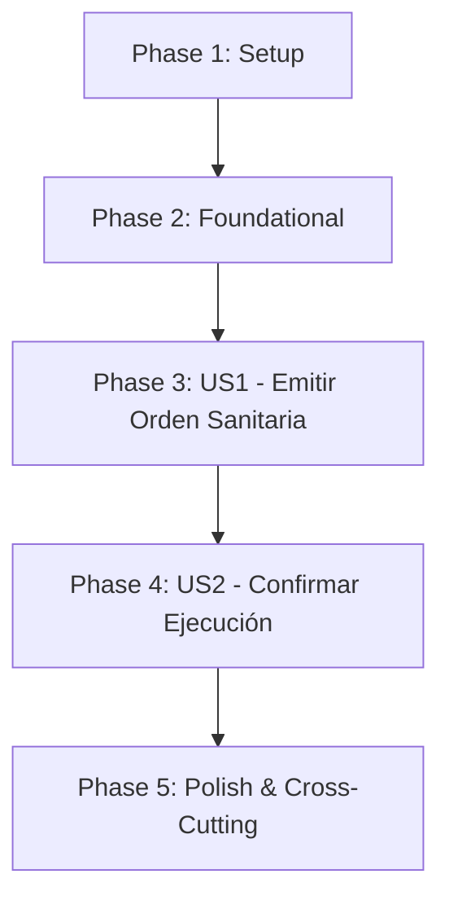

# Implementation Plan: Gestión del Sacrificio Sanitario

**Date**: 05/10/2026

**Arquitectura y tecnologías**: [General.md](General.md)

**Specs**:

- [012-OrdenarSacrificioSanitario.md](../specs/012-OrdenarSacrificioSanitario.md)

## Summary

Implementar la emisión y la confirmación de la ejecución de órdenes de sacrificio sanitario total por parte del personal veterinario, como respuesta de contención biológica ante diagnósticos confirmados de enfermedades mortales de notificación oficial en la granja avícola.

El plan asegura la separación estricta entre la orden y su ejecución efectiva: la emisión de la orden no altera la población del lote ni el estado operativo del galpón, manteniéndolo en estado de aislamiento hasta que se confirme la ejecución en campo. La confirmación de la ejecución opera como una transacción atómica local indivisible que fija en exactamente cero la población viva del lote, transiciona el estado operativo del galpón de aislamiento a vaciado sanitario y marca la orden como ejecutada, bloqueando cualquier intento de re-confirmación.

`Galpon` y `Lote` continúan siendo entidades autoritativas del Módulo 1; el diagnóstico clínico y la enfermedad pertenecen a la capacidad sanitaria del Plan 005 ([005-GestionDeEnfermedadesAislamientoYDiagnostico.md](005-GestionDeEnfermedadesAislamientoYDiagnostico.md)). Este plan orquesta dichas capacidades a través de puertos de salida públicos, sin crear tablas paralelas ni copias de datos ajenos. La orden de sacrificio sanitario es de alcance total (100 % de las aves alojadas) y no solicita pesajes, cantidades parciales ni liquidaciones económicas, las cuales corresponden exclusivamente al sacrificio comercial y al Módulo 3.

## Technical Context

**Integraciones específicas**: Consulta del diagnóstico clínico y validación del indicador `requiereSacrificioSanitario` del Plan 005 (`DiagnosticoGalponQueryPort`); consulta del estado operativo del galpón y población del lote del Módulo 1 (`GalponQueryPort`, `LoteQueryPort`); solicitud de cambio de estado operativo del galpón (`CambiarEstadoOperativoGalponPort`); vaciado atómico de inventario vivo a cero (`ActualizarInventarioVivoPort`); eventos internos con Spring Modulith y contratos de integración hacia Apache Kafka.

**Datos propios**: Órdenes de sacrificio sanitario (`OrdenSacrificioSanitario`) y su ciclo de vida auditado.

**Performance Goals**:
- El 95 % de las emisiones de órdenes de sacrificio sanitario se procesa y persiste en un tiempo máximo de 1 segundo.
- El 95 % de las confirmaciones de ejecución (incluyendo la actualización atómica del lote a cero y el cambio del galpón a vaciado sanitario) se completa en un tiempo máximo de 1 segundo.
- El 95 % de las consultas de estado y detalle de la orden responde en máximo 1 segundo.

**Constraints**:
- Acceso y rol exclusivo: tanto la emisión como la confirmación de la ejecución están restringidas exclusivamente al rol `ROLE_VETERINARIO`. Cualquier intento por parte de trabajadores u otros roles es bloqueado de forma inmediata con error `403 Forbidden`.
- Condición diagnóstica obligatoria: la orden solo procede si existe un diagnóstico confirmado en el galpón cuyo indicador `requiereSacrificioSanitario` sea estrictamente `true`.
- Estado del galpón: el galpón debe encontrarse obligatoriamente en estado `AISLAMIENTO` al momento de emitir la orden y debe permanecer en dicho estado hasta que se confirme su ejecución.
- Condición del lote: el lote activo debe contar con una población viva actual mayor que cero (`poblacionActual > 0`) tanto en la emisión como en la confirmación.
- Alcance total obligatorio: la orden abarca invariablemente a toda la población del lote alojado; el sistema no solicita ni permite ingresar una cantidad de aves a sacrificar.
- No alteración anticipada: una orden emitida en estado `PENDIENTE_EJECUCION` no modifica la población del lote ni el estado del galpón.
- Atomicidad en la ejecución: la confirmación debe establecer la población en cero, cambiar el galpón a `VACIADO_SANITARIO` y marcar la orden como `EJECUTADA` dentro de una única transacción local indivisible.
- Idempotencia e inmutabilidad: una orden ejecutada no puede volver a confirmarse ni editarse; cualquier intento posterior debe ser rechazado con error `409 Conflict`.
- Formato de errores RFC 9457: todas las respuestas ante inconsistencias o fallas utilizan `application/problem+json`.

**Scale/Scope**: Dos historias de usuario, tres endpoints REST, una entidad raíz con su máquina de estados, cinco puertos de salida hacia integración y persistencia, eventos internos y publicación de eventos de integración.

**Dependencias funcionales**:
- Diagnósticos clínicos y catálogo de enfermedades del Plan 005 ([005-GestionDeEnfermedadesAislamientoYDiagnostico.md](005-GestionDeEnfermedadesAislamientoYDiagnostico.md)).
- Consulta y mutación de galpones y lotes del Módulo 1 (reutilizando `GalponQueryPort`, `LoteQueryPort`, `CambiarEstadoOperativoGalponPort` y `ActualizarInventarioVivoPort`).
- Autenticación, actor autenticado, reloj compartido y formato de errores definidos en [General.md](General.md).

### Decisiones específicas

1. **Entidad y Ciclo de Vida de la Orden**:
   - `OrdenSacrificioSanitario` es la entidad raíz de este subdominio. Contiene UUID propio, `diagnosticoId`, `galponId`, `loteId`, `poblacionAfectadaMomento`, `motivoClinico`, `emitidaPor`, `emitidaEn`, `ejecutadaPor` (opcional), `ejecutadaEn` (opcional), `observacionesEjecucion` (opcional) y `estado` (`PENDIENTE_EJECUCION`, `EJECUTADA`).
2. **Unicidad de Orden Activa por Galpón**:
   No se permite emitir una segunda orden de sacrificio sanitario si ya existe una orden previa en estado `PENDIENTE_EJECUCION` para el mismo galpón y lote activo.
3. **Validación Diagnóstica en Tiempo Real**:
   Al momento de solicitar la emisión, el caso de uso consulta `DiagnosticoGalponQueryPort` para certificar que el diagnóstico existe, corresponde al galpón evaluado y su enfermedad tiene activado el indicador booleano `requiereSacrificioSanitario`. Si no se puede comprobar o el indicador es falso, la operación se rechaza con código `409 Conflict`.
4. **Verificación del Estado de Aislamiento**:
   El galpón debe encontrarse en estado `AISLAMIENTO`. Si el galpón se encuentra en `PRODUCTIVO`, `EN_COSECHA`, `DISPONIBLE` o `VACIADO_SANITARIO`, la emisión se cancela inmediatamente informando que el sacrificio sanitario requiere aislamiento previo.
5. **Transición Atómica de Ejecución**:
   Al invocar `ConfirmarEjecucionSacrificioSanitarioUseCase`, se ejecuta una transacción local que:
   - Valida que la orden continúe en estado `PENDIENTE_EJECUCION`.
   - Consulta y bloquea el lote activo para verificar que aún tenga aves vivas.
   - Invoca `ActualizarInventarioVivoPort.fijarPoblacionEnCero(loteId)` para extinguir el inventario vivo del lote.
   - Invoca `CambiarEstadoOperativoGalponPort.cambiarEstado(galponId, AISLAMIENTO, VACIADO_SANITARIO)`.
   - Actualiza la orden a estado `EJECUTADA`, registrando el veterinario confirmante (`ejecutadaPor`) y el instante UTC (`ejecutadaEn`).
   - Publica los eventos de dominio correspondientes.
6. **Desacoplamiento de Pesajes y Liquidación**:
   El sacrificio sanitario no genera registros de peso comercial, precios ni liquidación de rentabilidad; las aves sacrificadas por motivos sanitarios se consideran merma biológica no comercializable.
7. **Eventos Internos (Spring Modulith)**:
   - `SacrificioSanitarioOrdenadoEvent`: Notifica a los equipos de bioseguridad la emisión de la orden.
   - `SacrificioSanitarioEjecutadoEvent`: Notifica la confirmación de la ejecución, permitiendo que otros subdominios (limpieza, desinfección) inicien el protocolo de vaciado sanitario.
8. **Eventos de Integración (Apache Kafka)**:
   - `AviControl.Sanitario.SacrificioSanitarioEjecutado.v1`: Publicado mediante outbox pattern para que el Módulo 3 registre la baja contable integral del activo biológico sin generar ingresos por venta.
9. **Persistencia y Migraciones**:
   Flyway creará la tabla `orden_sacrificio_sanitario` con índices por `galpon_id`, `lote_id`, `diagnostico_id` y `estado`.
10. **Auditoría de Acciones Veterinarias**:
    Se audita con precisión el UUID del veterinario que emitió la orden y del que confirmó su ejecución física mediante el `SecurityContext` / actor autenticado.

### Alcance documental

- La identificación de signos clínicos, solicitud de aislamiento, validación y confirmación del diagnóstico corresponden a [005-GestionDeEnfermedadesAislamientoYDiagnostico.md](005-GestionDeEnfermedadesAislamientoYDiagnostico.md). Este plan solo consume el diagnóstico resultante.
- El sacrificio comercial por cumplimiento del ciclo de engorde (edad $\ge 45$ días) y el pesaje final para liquidación corresponden al Plan 009 ([009-AptitudProgramacionYResultadosDelSacrificioProductivo.md](009-AptitudProgramacionYResultadosDelSacrificioProductivo.md)).
- Los protocolos físicos de enterramiento, incineración o compostaje sanitario de las aves muertas quedan fuera del alcance del software de gestión operativa.

## Project Structure

### Documentation (this feature)

```text
docs/
├── specs/
│   └── 012-OrdenarSacrificioSanitario.md
└── plan/
    └── 008-GestionDelSacrificioSanitario.md
```

### Source Code (repository root)

```text
src/main/java/com/avicontrol/
├── domain/
│   ├── model/sanitario/sacrificio/
│   │   ├── OrdenSacrificioSanitario.java
│   │   └── EstadoOrdenSanitaria.java
│   ├── event/sanitario/sacrificio/
│   │   ├── SacrificioSanitarioOrdenadoEvent.java
│   │   └── SacrificioSanitarioEjecutadoEvent.java
│   ├── exception/sanitario/sacrificio/
│   │   ├── OrdenSacrificioSanitarioNoEncontradaException.java
│   │   ├── DiagnosticoNoRequiereSacrificioException.java
│   │   ├── GalponNoEstaEnAislamientoException.java
│   │   ├── LoteSinPoblacionVivaException.java
│   │   └── OrdenSacrificioYaEjecutadaException.java
│   └── port/out/sanitario/sacrificio/
│       ├── OrdenSacrificioSanitarioRepositoryPort.java
│       ├── DiagnosticoGalponQueryPort.java
│       ├── GalponQueryPort.java
│       ├── LoteQueryPort.java
│       ├── CambiarEstadoOperativoGalponPort.java
│       ├── ActualizarInventarioVivoPort.java
│       └── IntegrationEventPublisherPort.java
├── application/sanitario/sacrificio/
│   ├── EmitirOrdenSacrificioSanitarioUseCase.java
│   ├── ConfirmarEjecucionSacrificioSanitarioUseCase.java
│   ├── ConsultarOrdenSacrificioSanitarioUseCase.java
│   ├── command/
│   │   ├── EmitirOrdenSacrificioSanitarioCommand.java
│   │   └── ConfirmarEjecucionSacrificioSanitarioCommand.java
│   └── result/
│       ├── OrdenSacrificioSanitarioResult.java
│       └── EjecucionSacrificioSanitarioResult.java
└── infrastructure/
    ├── adapter/in/rest/sanitario/sacrificio/
    │   ├── OrdenSacrificioSanitarioController.java
    │   ├── dto/
    │   │   ├── EmitirOrdenSacrificioSanitarioRequest.java
    │   │   ├── ConfirmarEjecucionSacrificioSanitarioRequest.java
    │   │   └── OrdenSacrificioSanitarioResponse.java
    │   └── mapper/OrdenSacrificioSanitarioRestMapper.java
    ├── adapter/out/
    │   ├── persistence/sanitario/sacrificio/
    │   │   ├── entity/OrdenSacrificioSanitarioEntity.java
    │   │   ├── repository/SpringDataOrdenSacrificioSanitarioRepository.java
    │   │   ├── mapper/OrdenSacrificioSanitarioPersistenceMapper.java
    │   │   └── OrdenSacrificioSanitarioPersistenceAdapter.java
    │   └── internal/sanitario/sacrificio/
    │       └── DiagnosticoGalponQueryAdapter.java
    └── config/
        └── SacrificioSanitarioBeanConfiguration.java

src/test/java/com/avicontrol/
├── domain/model/sanitario/sacrificio/
│   └── OrdenSacrificioSanitarioTest.java
├── application/sanitario/sacrificio/
│   ├── EmitirOrdenSacrificioSanitarioUseCaseTest.java
│   ├── ConfirmarEjecucionSacrificioSanitarioUseCaseTest.java
│   └── ConsultarOrdenSacrificioSanitarioUseCaseTest.java
└── infrastructure/
    ├── adapter/in/rest/sanitario/sacrificio/
    │   └── OrdenSacrificioSanitarioControllerTest.java
    ├── adapter/out/persistence/sanitario/sacrificio/
    │   └── OrdenSacrificioSanitarioPersistenceAdapterTest.java
    └── integration/sanitario/sacrificio/
        └── SacrificioSanitarioFlowIntegrationTest.java
```

**Structure Decision**: Arquitectura hexagonal modular en Java 21 / Spring Boot 4. Dominio puro libre de frameworks; casos de uso transaccionales que orquestan las validaciones diagnósticas y operativas; adaptadores desacoplados de persistencia e integración con Módulo 1 y Kafka.

### Entidades y relación

```text
OrdenSacrificioSanitario (Agregado Raíz)
├── id: UUID
├── diagnosticoId: UUID
├── galponId: UUID
├── loteId: UUID
├── poblacionAfectadaMomento: Integer (> 0)
├── motivoClinico: String
├── emitidaPor: UUID
├── emitidaEn: Instant
├── ejecutadaPor: UUID (opcional)
├── ejecutadaEn: Instant (opcional)
├── observacionesEjecucion: String (opcional)
└── estado: EstadoOrdenSanitaria (PENDIENTE_EJECUCION, EJECUTADA)
```

Relaciones:
- La orden se vincula de forma unívoca a un `DiagnosticoGalpon` de Plan 005 cuya enfermedad exige sacrificio sanitario.
- Referencia al `Galpon` en estado `AISLAMIENTO` y al `Lote` activo con aves vivas alojadas.
- La confirmación transiciona la orden a `EJECUTADA`, pone a `0` la población del `Lote` y pasa el `Galpon` a `VACIADO_SANITARIO`.

### Contratos de los puertos

| Puerto | Tipo | Responsabilidad |
| --- | --- | --- |
| `OrdenSacrificioSanitarioRepositoryPort` | Salida (Persistencia) | Guardar y actualizar órdenes inmutables, buscar por UUID y verificar órdenes pendientes activas por galpón. |
| `DiagnosticoGalponQueryPort` | Salida (Integración Plan 005) | Consultar existencia del diagnóstico, enfermedad asociada y valor de `requiereSacrificioSanitario`. |
| `GalponQueryPort` | Salida (Integración Módulo 1) | Verificar que el galpón exista y se encuentre en estado `AISLAMIENTO`. |
| `LoteQueryPort` | Salida (Integración Módulo 1) | Verificar lote activo alojado y población actual mayor a cero. |
| `CambiarEstadoOperativoGalponPort` | Salida (Integración Módulo 1) | Ejecutar la transición del galpón de `AISLAMIENTO` a `VACIADO_SANITARIO`. |
| `ActualizarInventarioVivoPort` | Salida (Integración Módulo 1) | Reducir a exactamente cero (`poblacionActual = 0`) la población viva del lote. |
| `IntegrationEventPublisherPort` | Salida (Eventos Externos) | Publicar a Kafka el contrato de sacrificio sanitario ejecutado para el Módulo 3. |

### Contratos HTTP propuestos

| Endpoint | Verbo | Acceso | Propósito |
| --- | --- | --- | --- |
| `/api/galpones/{galponId}/ordenes-sacrificio-sanitario` | POST | `ROLE_VETERINARIO` | Emitir orden de sacrificio sanitario total pendiente de ejecución. |
| `/api/ordenes-sacrificio-sanitario/{ordenId}/ejecucion` | POST | `ROLE_VETERINARIO` | Confirmar la ejecución física: población a cero y galpón a vaciado sanitario. |
| `/api/ordenes-sacrificio-sanitario/{ordenId}` | GET | `ROLE_VETERINARIO`, `ROLE_ADMINISTRADOR` | Consultar el detalle y estado de una orden de sacrificio sanitario. |

### JSON común de errores

Siguiendo RFC 9457 y [General.md](General.md):

```json
{
  "type": "https://avicontrol/errors/galpon-no-en-aislamiento",
  "title": "Conflicto en emisión de sacrificio sanitario",
  "status": 409,
  "detail": "El galpón 550e8400-e29b-41d4-a716-446655440001 debe encontrarse en estado AISLAMIENTO (estado actual: PRODUCTIVO)",
  "instance": "/api/galpones/550e8400-e29b-41d4-a716-446655440001/ordenes-sacrificio-sanitario",
  "code": "GALPON_NO_ESTA_EN_AISLAMIENTO",
  "correlationId": "f4b07384-e113-4a1a-bb02-885b058c672b",
  "fieldErrors": []
}
```

---

## Phase 1: Setup (Shared Infrastructure)

**Purpose**: Preparar configuraciones de seguridad, fixtures y contratos de comunicación interna.

- [ ] T001 Revisar el contrato de `DiagnosticoGalponQueryPort` con el Plan 005 para asegurar que exponga el identificador de enfermedad y el flag booleano `requiereSacrificioSanitario`.
- [ ] T002 Verificar los contratos de `CambiarEstadoOperativoGalponPort` y `ActualizarInventarioVivoPort` con el Módulo 1 para la transición a `VACIADO_SANITARIO` y reseteo de población a cero.
- [ ] T003 Configurar en Spring Security la restricción de acceso estricta para que únicamente usuarios autenticados con `ROLE_VETERINARIO` puedan invocar endpoints de emisión y confirmación de sacrificio sanitario.
- [ ] T004 Crear fixtures de pruebas: galpón en aislamiento con lote activo, galpón en producción, diagnóstico tratable (sin sacrificio), diagnóstico con sacrificio requerido y órdenes en estado pendiente y ejecutada.

**Checkpoint**: Contratos y seguridad acordados sin ambigüedades.

---

## Phase 2: Foundational (Blocking Prerequisites)

**Purpose**: Construir entidades de dominio, excepciones, migraciones Flyway y adaptadores de persistencia.

- [ ] T005 Implementar en Java puro la entidad `OrdenSacrificioSanitario` y el enum `EstadoOrdenSanitaria` (`PENDIENTE_EJECUCION`, `EJECUTADA`) con sus validaciones de negocio e invariantes.
- [ ] T006 Implementar las excepciones de negocio: `OrdenSacrificioSanitarioNoEncontradaException`, `DiagnosticoNoRequiereSacrificioException`, `GalponNoEstaEnAislamientoException`, `LoteSinPoblacionVivaException` y `OrdenSacrificioYaEjecutadaException`.
- [ ] T007 Definir las interfaces de salida `OrdenSacrificioSanitarioRepositoryPort` y `DiagnosticoGalponQueryPort`.
- [ ] T008 Crear la migración Flyway (`V8__create_orden_sacrificio_sanitario_table.sql`) creando la tabla `orden_sacrificio_sanitario` con índices por `galpon_id`, `lote_id`, `diagnostico_id` y `estado`.
- [ ] T009 Implementar la entidad JPA `OrdenSacrificioSanitarioEntity`, el repositorio Spring Data y el mapper de persistencia `OrdenSacrificioSanitarioPersistenceMapper`.
- [ ] T010 Implementar `OrdenSacrificioSanitarioPersistenceAdapter` asegurando la persistencia inmutable y el bloqueo de actualizaciones sobre órdenes ya ejecutadas.
- [ ] T011 Configurar la composición de beans en `SacrificioSanitarioBeanConfiguration` y el soporte transaccional `@Transactional`.

**Checkpoint**: Infraestructura base de dominio y persistencia lista para soportar las historias de usuario.

---

## Phase 3: User Story 1 — Emitir una Orden de Sacrificio Sanitario Total (Priority: P1)

**Spec**: [012-OrdenarSacrificioSanitario.md](../specs/012-OrdenarSacrificioSanitario.md), historia 1.

**Goal**: El veterinario emite una orden de sacrificio sanitario total respaldada en un diagnóstico confirmado cuya enfermedad requiere dicha medida, quedando asociada al galpón en aislamiento y al lote activo, en estado pendiente de ejecución y sin alterar aún al galpón ni al lote.

**Independent Test**: Invocar la emisión sobre un galpón en `AISLAMIENTO` con lote de 3.500 aves y diagnóstico con sacrificio requerido; verificar que se cree la orden con estado `PENDIENTE_EJECUCION`, que abarque las 3.500 aves sin haber pedido una cantidad, y que el lote y galpón permanezcan intactos. Intentar emitir sin rol de veterinario o con enfermedad tratable y comprobar el rechazo.

### Definición del evento para User Story 1

**Evento producido**: `SacrificioSanitarioOrdenadoEvent`
- Atributos: `eventId`, `ordenId`, `galponId`, `loteId`, `diagnosticoId`, `poblacionAfectada`, `emitidaPor`, `emitidaEn`.

**Evento consumido**: Ninguno.

### Definición del endpoint REST para User Story 1

| Elemento | Definición |
| --- | --- |
| Método y ruta | `POST /api/galpones/{galponId}/ordenes-sacrificio-sanitario` |
| Autorización | `ROLE_VETERINARIO` |
| Entrada (Path) | `galponId` (UUID obligatorio) |
| Entrada (Body) | `diagnosticoId` (UUID obligatorio), `motivoClinico` (String obligatorio) |
| Respuesta 201 | `OrdenSacrificioSanitarioResponse` con estado `PENDIENTE_EJECUCION` y datos vinculados |
| Errores | 400 por datos ausentes; 401 sin autenticación; 403 para usuarios no veterinarios; 404 si el galpón o diagnóstico no existen; 409 si la enfermedad no requiere sacrificio, si el galpón no está en aislamiento o si ya existe orden pendiente |

#### JSON de solicitud (Request)

```json
{
  "diagnosticoId": "b1a2c3d4-e5f6-7a8b-9c0d-1e2f3a4b5c6d",
  "motivoClinico": "Brote agudo confirmado de Influenza Aviar de alta patogenicidad. Disposición sanitaria urgente."
}
```

#### JSON de respuesta exitosa (Response 201)

```json
{
  "id": "9c8e7d6c-5b4a-3f2e-1d0c-9b8a7f6e5d4c",
  "diagnosticoId": "b1a2c3d4-e5f6-7a8b-9c0d-1e2f3a4b5c6d",
  "galponId": "550e8400-e29b-41d4-a716-446655440001",
  "loteId": "2fc03a21-84c4-4c83-bb15-6607bb75cb90",
  "poblacionAfectada": 3500,
  "motivoClinico": "Brote agudo confirmado de Influenza Aviar de alta patogenicidad. Disposición sanitaria urgente.",
  "estado": "PENDIENTE_EJECUCION",
  "emitidaPor": "a1b2c3d4-e5f6-7a8b-9c0d-1e2f3a4b5c6d",
  "emitidaEn": "2026-10-05T14:30:00Z"
}
```

### Tests para User Story 1

- [ ] T012 [P] [US1] Unit test en `OrdenSacrificioSanitarioTest`: verificar validación de invariantes, estado inicial `PENDIENTE_EJECUCION` y campos obligatorios.
- [ ] T013 [P] [US1] Unit test en `EmitirOrdenSacrificioSanitarioUseCaseTest`: verificar comprobación del diagnóstico con `requiereSacrificioSanitario = true`, galpón en `AISLAMIENTO`, rechazo ante enfermedad no mortal y rechazo ante galpón sin aves vivas.
- [ ] T014 [P] [US1] Contract test en `OrdenSacrificioSanitarioControllerTest`: verificar respuestas HTTP 201, 403 para operarios/administradores y 409 ante condiciones diagnósticas incompatibles.

### Implementación para User Story 1

- [ ] T015 [P] [US1] Implementar DTOs `EmitirOrdenSacrificioSanitarioRequest`, `OrdenSacrificioSanitarioResponse` y mapper `OrdenSacrificioSanitarioRestMapper`.
- [ ] T016 [P] [US1] Implementar `EmitirOrdenSacrificioSanitarioUseCase` coordinando consultas a `DiagnosticoGalponQueryPort`, `GalponQueryPort` y `LoteQueryPort`, persistiendo en repositorio y publicando `SacrificioSanitarioOrdenadoEvent`.
- [ ] T017 [US1] Implementar endpoint `POST /api/galpones/{galponId}/ordenes-sacrificio-sanitario` en `OrdenSacrificioSanitarioController`.

**Checkpoint**: Emisión de órdenes sanitarias totales operando bajo control veterinario estricto.

---

## Phase 4: User Story 2 — Confirmar la Ejecución del Sacrificio Sanitario Total (Priority: P2)

**Spec**: [012-OrdenarSacrificioSanitario.md](../specs/012-OrdenarSacrificioSanitario.md), historia 2.

**Goal**: El veterinario confirma que el sacrificio sanitario total fue ejecutado en campo, lo que extingue a cero la población viva del lote, pasa el galpón a vaciado sanitario y marca la orden como ejecutada de forma atómica e irreversible.

**Independent Test**: Confirmar una orden pendiente; verificar que `poblacionActual` del lote pase a 0, que el galpón transicione a `VACIADO_SANITARIO`, que la orden pase a `EJECUTADA` y que un segundo intento de confirmación sea rechazado con `409 Conflict`.

### Definición del evento para User Story 2

**Evento producido**: `SacrificioSanitarioEjecutadoEvent`
- Atributos: `eventId`, `ordenId`, `galponId`, `loteId`, `poblacionSacrificada`, `ejecutadaPor`, `ejecutadaEn`.

**Evento de integración (Kafka)**: `AviControl.Sanitario.SacrificioSanitarioEjecutado.v1`
- Payload: `ordenId`, `galponId`, `loteId`, `poblacionSacrificada`, `fechaHoraEjecucion`.

### Definición del endpoint REST para User Story 2

| Elemento | Definición |
| --- | --- |
| Método y ruta | `POST /api/ordenes-sacrificio-sanitario/{ordenId}/ejecucion` |
| Autorización | `ROLE_VETERINARIO` |
| Entrada (Path) | `ordenId` (UUID obligatorio) |
| Entrada (Body) | `observacionesEjecucion` (String opcional) |
| Respuesta 200 | `OrdenSacrificioSanitarioResponse` con estado `EJECUTADA`, fecha y veterinario ejecutor |
| Errores | 401 sin autenticación; 403 para usuarios no veterinarios; 404 si la orden no existe; 409 si la orden ya fue ejecutada, el galpón ya no está en aislamiento o la población ya es cero |

#### JSON de solicitud (Request)

```json
{
  "observacionesEjecucion": "Sacrificio sanitario total culminado bajo protocolo de bioseguridad nivel 3. Galpón sellado para inicio de desinfección."
}
```

#### JSON de respuesta exitosa (Response 200)

```json
{
  "id": "9c8e7d6c-5b4a-3f2e-1d0c-9b8a7f6e5d4c",
  "diagnosticoId": "b1a2c3d4-e5f6-7a8b-9c0d-1e2f3a4b5c6d",
  "galponId": "550e8400-e29b-41d4-a716-446655440001",
  "loteId": "2fc03a21-84c4-4c83-bb15-6607bb75cb90",
  "poblacionAfectada": 3500,
  "motivoClinico": "Brote agudo confirmado de Influenza Aviar de alta patogenicidad. Disposición sanitaria urgente.",
  "estado": "EJECUTADA",
  "emitidaPor": "a1b2c3d4-e5f6-7a8b-9c0d-1e2f3a4b5c6d",
  "emitidaEn": "2026-10-05T14:30:00Z",
  "ejecutadaPor": "a1b2c3d4-e5f6-7a8b-9c0d-1e2f3a4b5c6d",
  "ejecutadaEn": "2026-10-05T16:00:00Z",
  "observacionesEjecucion": "Sacrificio sanitario total culminado bajo protocolo de bioseguridad nivel 3. Galpón sellado para inicio de desinfección."
}
```

### Tests para User Story 2

- [ ] T018 [P] [US2] Unit test en `ConfirmarEjecucionSacrificioSanitarioUseCaseTest`: verificar ejecución atómica, reducción de población a 0, cambio de estado del galpón a `VACIADO_SANITARIO` y transición de orden a `EJECUTADA`.
- [ ] T019 [P] [US2] Probar rechazo ante re-confirmación de orden ya ejecutada (`409 Conflict`) y ante cambio no autorizado del estado del galpón.
- [ ] T020 [P] [US2] Contract test en `OrdenSacrificioSanitarioControllerTest` para `POST /ejecucion` y consulta `GET /{ordenId}`.

### Implementación para User Story 2

- [ ] T021 [P] [US2] Implementar `ConfirmarEjecucionSacrificioSanitarioUseCase` con invocación transaccional a `ActualizarInventarioVivoPort`, `CambiarEstadoOperativoGalponPort` y publicación de eventos.
- [ ] T022 [P] [US2] Implementar `ConsultarOrdenSacrificioSanitarioUseCase` para visualización del estado de la orden.
- [ ] T023 [US2] Implementar endpoints `POST /api/ordenes-sacrificio-sanitario/{ordenId}/ejecucion` y `GET /api/ordenes-sacrificio-sanitario/{ordenId}` en `OrdenSacrificioSanitarioController`.

**Checkpoint**: Ejecución atómica de sacrificio sanitario confirmada e irreversible.

---

## Phase 5: Polish & Cross-Cutting Concerns

**Purpose**: Verificación de integración, documentación OpenAPI y observabilidad.

- [ ] T024 Documentar endpoints de sacrificio sanitario y esquemas de error RFC 9457 en la especificación OpenAPI 3.
- [ ] T025 Completar `SacrificioSanitarioFlowIntegrationTest`: flujo completo desde emisión hasta confirmación con Testcontainers (PostgreSQL y Kafka reales), verificando el vaciado de población en el Módulo 1 y la publicación del evento de integración.
- [ ] T026 Comprobar reglas de arquitectura ArchUnit para el paquete de sacrificio sanitario.
- [ ] T027 Registrar métricas operativas con Micrometer para órdenes emitidas y ejecutadas.

**Checkpoint**: Plan 008 completado, probado y documentado.

---

## Dependencies & Execution Order

### Phase Dependencies



- **Setup**: Acuerda contratos diagnósticos y de inventario.
- **Foundational**: Crea entidades y tablas base; bloquea historias.
- **US1**: Emisión de orden pendiente; insumo necesario para US2.
- **US2**: Confirmación y vaciado; depende de US1.
- **Polish**: Pruebas de integración finales.

### Dependencias con otros planes

- **Plan 005**: Suministra la validación clínica de la enfermedad que habilita la orden.
- **Módulo 1**: Gestiona el cambio de estado operativo a `VACIADO_SANITARIO` y la puesta a cero del lote activo.
- **Módulo 3**: Consume `AviControl.Sanitario.SacrificioSanitarioEjecutado.v1` para la baja contable del lote sin liquidación comercial.

---

## Notes

- El sacrificio sanitario es una medida exclusivamente biológica y no comercial.
- Las tareas `T001` a `T027` cubren la totalidad del ciclo de vida del [SPEC-012](../specs/012-OrdenarSacrificioSanitario.md).
