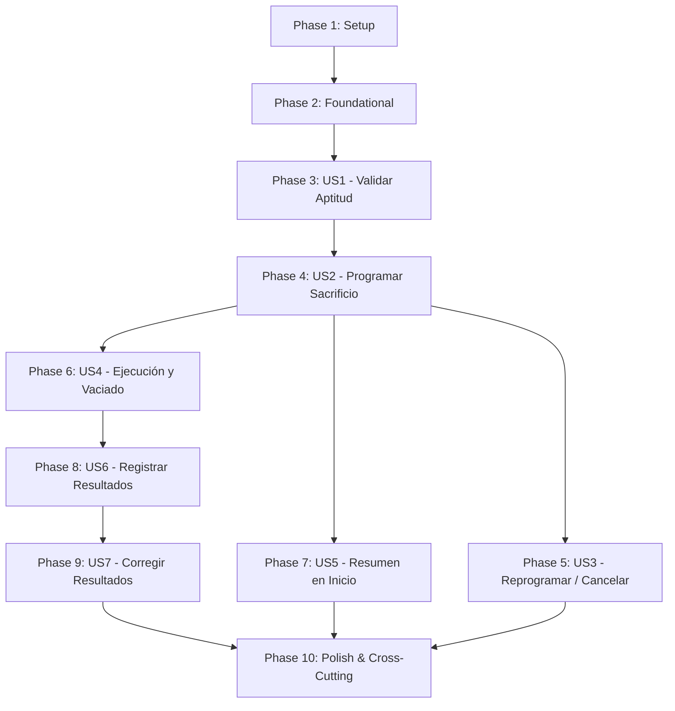

# Implementation Plan: Aptitud, Programación y Resultados del Sacrificio Productivo

**Date**: 05/10/2026

**Arquitectura y tecnologías**: [General.md](General.md)

**Specs**:

- [004-ValidarAptoParaSacrifico.md](../specs/004-ValidarAptoParaSacrifico.md)
- [005-OrdenarSacrificioPorGalpon.md](../specs/005-OrdenarSacrificioPorGalpon.md)
- [006-RegistrarPesoDePollosFinales.md](../specs/006-RegistrarPesoDePollosFinales.md)

## Summary

Implementar el ciclo completo del sacrificio comercial o productivo en AviControl Módulo 2: la evaluación y validación de aptitud zootécnica de galpones y lotes alojados que alcanzan la edad mínima de beneficio ($\ge 45$ días), la programación anticipada, reprogramación y cancelación de órdenes de sacrificio comercial, la ejecución automática o confirmada que transiciona el galpón a vaciado sanitario y finaliza el ciclo de alojamiento, la consulta agregada de órdenes para la pantalla de inicio del administrador, y el registro y corrección auditada del peso total en kilogramos y cantidad de pollos finales sacrificados para alimentar la liquidación de rentabilidad del Módulo 3.

El plan desacopla estrictamente el sacrificio comercial del sacrificio sanitario: mientras el sanitario es una medida clínica de emergencia ejecutada por el veterinario sobre aves enfermas en aislamiento, el productivo es gestionado de forma exclusiva por el administrador sobre lotes sanos que culminan satisfactoriamente su etapa de engorde. Una validación apta transiciona el galpón a estado `En cosecha`, reservando el espacio hasta la fecha y hora programadas. Al ejecutarse la orden, el galpón transiciona a `Vaciado sanitario` y se extingue el alojamiento. Posteriormente, se registra el pesaje final, el cual permanece corregible únicamente mientras el Módulo 3 no lo haya utilizado en una liquidación contable formal.

`Galpon` y `Lote` son entidades propietarias del Módulo 1 y se consultan o mutan mediante puertos de aplicación. Los cálculos económicos y la liquidación comercial pertenecen al Módulo 3 y se alimentan mediante eventos de integración. Este plan administra las órdenes comerciales y los pesajes finales sin duplicar tablas ni persistir entidades ajenas.

## Technical Context

**Integraciones específicas**: Consulta de galpones, lotes alojados, fechas de ingreso y edad en días desde el Módulo 1 (`GalponQueryPort`, `LoteQueryPort`); solicitud de cambio de estado operativo del galpón a `EN_COSECHA` y posteriormente a `VACIADO_SANITARIO` (`CambiarEstadoOperativoGalponPort`); finalización de la relación de alojamiento del lote (`FinalizarAlojamientoLotePort`); eventos internos con Spring Modulith; contratos de integración versionados a Apache Kafka para el Módulo 3 (`AviControl.Sacrificio.ResultadosFinalesConfirmados.v1`).

**Datos propios**: Validaciones de aptitud, órdenes de sacrificio productivo (`OrdenSacrificioProductivo`), máquina de estados de la programación y registros de pesajes y resultados finales (`ResultadoSacrificioProductivo`).

**Performance Goals**:
- El 95 % de las validaciones de aptitud, programaciones, reprogramaciones y cancelaciones se confirma en un tiempo máximo de 1 segundo.
- Al menos el 99 % de las órdenes ejecutadas transiciona el galpón a `VACIADO_SANITARIO` y finaliza el alojamiento dentro del primer minuto posterior al cumplimiento de la fecha/hora programada.
- El 95 % de las consultas de resumen para la pantalla de inicio responde en máximo 1 segundo sin realizar escrituras.
- El 95 % de los registros y correcciones de peso y cantidad final queda disponible para el Módulo 3 en un máximo de 2 segundos.

**Constraints**:
- Acceso exclusivo de administrador: todas las operaciones de este plan (validar aptitud, programar, reprogramar, cancelar, consultar resumen, registrar pesajes y corregir resultados) exigen estrictamente el rol `ROLE_ADMINISTRADOR`.
- Condiciones de aptitud: un galpón es `Apto` exclusivamente si se encuentra en estado `PRODUCTIVO` (o `productiva`) y la edad calculada del lote activo es igual o superior a 45 días calendario (`diasTotales >= 45`). Si alguna condición falla, el sistema dictamina `No apto` con las razones explícitas y no modifica el galpón.
- Transición a cosecha: únicamente un resultado `Apto` transiciona el galpón a estado `EN_COSECHA`.
- Programación futura: toda orden o reprogramación debe establecer una fecha y hora estrictamente posterior al momento actual del sistema (`Clock` en UTC / `America/Bogota`).
- Ventana de modificación: una orden solo puede reprogramarse o cancelarse antes de que se cumpla la fecha y hora programadas. Al llegar dicho momento, la orden no admite modificaciones.
- Unicidad de resultados: existe un único registro de resultado final por lote/orden ejecutada; cualquier intento de crear un segundo registro es bloqueado.
- Precisión de pesaje: la cantidad final de pollos debe ser un entero estrictamente positivo (`> 0`); el peso total en kilogramos debe ser estrictamente positivo (`> 0.00 kg`) expresado mediante `BigDecimal` con escala exacta de 2 decimales.
- Bloqueo de corrección por consumo: los resultados finales admiten corrección mientras su estado sea `DISPONIBLE_PARA_LIQUIDACION`. En el momento en que el Módulo 3 confirme su utilización en una liquidación contable (`UTILIZADO_EN_LIQUIDACION`), cualquier intento de corrección posterior es rechazado con error `409 Conflict`.
- Formato RFC 9457: todas las respuestas de error utilizan `application/problem+json`.

**Scale/Scope**: Siete historias de usuario, ocho endpoints REST, dos entidades de dominio principales, una tarea programada para ejecución de órdenes cumplidas, eventos internos y publicación de eventos de integración hacia Kafka.

**Dependencias funcionales**:
- Galpones y lotes vigentes gestionados por Módulo 1 (reutilizando [001-ConsultaYSeguimientoDeGalpones.md](001-ConsultaYSeguimientoDeGalpones.md)).
- Capacidad de liquidación y costos del Módulo 3.
- Autenticación, actor autenticado, reloj compartido y formato de errores de [General.md](General.md).

### Decisiones específicas

1. **Entidades y Modelos Propios**:
   - `ValidacionAptitud`: Objeto de valor que encapsula el resultado (`APTO` / `NO_APTO`), edad evaluada en días, estado previo del galpón, motivos de rechazo y timestamp de evaluación.
   - `OrdenSacrificioProductivo`: Entidad raíz con UUID, `galponId`, `loteId`, `fechaHoraProgramada`, `fechaHoraEjecucion` (opcional), `programadaPor`, `motivoCancelacion` (opcional) y `estado` (`PROGRAMADA`, `REPROGRAMADA`, `EJECUTADA`, `CANCELADA`).
   - `ResultadoSacrificioProductivo`: Entidad que captura los valores de salida del lote: UUID, `ordenId`, `loteId`, `galponId`, `cantidadFinalPollos`, `pesoTotalKg`, `pesoPromedioAveKg` (derivado), `registradoPor`, `registradoEn`, `corregidoPor` (opcional), `corregidoEn` (opcional) y `estadoUtilizacion` (`DISPONIBLE_PARA_LIQUIDACION`, `UTILIZADO_EN_LIQUIDACION`).
2. **Cálculo de la Edad para Aptitud**:
   Se reutiliza la regla zootécnica de dominio establecida en Plan 001: la edad se calcula en días calendario completos desde la `fechaIngreso` del lote hasta la fecha de consulta (`Clock`), contando el día de ingreso como día 1. No se aceptan fechas futuras ni aproximaciones mensuales.
3. **Reserva del Galpón en Estado `EN_COSECHA`**:
   Cuando la validación dictamina `APTO`, el caso de uso invoca `CambiarEstadoOperativoGalponPort` para pasar el galpón de `PRODUCTIVO` a `EN_COSECHA`. Mientras la orden esté programada o sea reprogramada, el galpón se mantiene en `EN_COSECHA`, impidiendo el ingreso de nuevos lotes o solicitudes de alimentación estándar.
4. **Cancelación Segura de la Orden**:
   Si una orden programada es cancelada antes de su ejecución, la orden pasa a estado `CANCELADA`. El galpón conserva su estado `EN_COSECHA` y el lote permanece alojado, permitiendo al administrador volver a programar la fecha de beneficio sin repetir la validación biológica previa.
5. **Mecanismo de Ejecución de la Orden**:
   Al alcanzarse la fecha y hora programadas, la ejecución de la orden puede dispararse por dos vías:
   - Tarea en segundo plano (`EjecucionSacrificioProductivoScheduler`) que verifica cada minuto órdenes cuya `fechaHoraProgramada <= Clock.now()` en estado `PROGRAMADA` o `REPROGRAMADA`.
   - Invocación explícita o confirmación por el administrador desde el endpoint de ejecución.
   En ambos casos, la ejecución aplica atómicamente:
   1. Cambio de estado de la orden a `EJECUTADA`.
   2. Transición del galpón de `EN_COSECHA` a `VACIADO_SANITARIO` vía `CambiarEstadoOperativoGalponPort`.
   3. Finalización del ciclo de alojamiento del lote vía `FinalizarAlojamientoLotePort`.
   4. Publicación del evento `OrdenSacrificioProductivoEjecutadaEvent`.
6. **Resumen de Pantalla de Inicio**:
   El endpoint `/resumen` consulta de forma transaccional de solo lectura la cantidad total de órdenes registradas históricamente y la cantidad de órdenes con estado en (`PROGRAMADA`, `REPROGRAMADA`). No altera ninguna entidad.
7. **Cálculo Derivado de Peso Promedio por Ave**:
   $$\text{pesoPromedioAveKg} = \frac{\text{pesoTotalKg}}{\text{cantidadFinalPollos}}$$
   Se calcula automáticamente con `BigDecimal` y 3 decimales para auditoría de calidad antes de su envío a liquidación.
8. **Bloqueo Concurrente en Corrección vs Utilización**:
   Se implementa control de concurrencia optimista (`@Version`) sobre `ResultadoSacrificioProductivoEntity`. Si una solicitud de corrección colisiona con el evento o llamada del Módulo 3 que marca el resultado como `UTILIZADO_EN_LIQUIDACION`, la base de datos aborta la transacción que pierda la carrera para salvaguardar la exactitud contable.
9. **Eventos Internos (Spring Modulith)**:
   - `GalponAptoParaSacrificioEvent`
   - `OrdenSacrificioProductivoProgramadaEvent`
   - `OrdenSacrificioProductivoCanceladaEvent`
   - `OrdenSacrificioProductivoEjecutadaEvent`
   - `ResultadoSacrificioRegistradoEvent`
   - `ResultadoSacrificioCorregidoEvent`
10. **Eventos de Integración (Apache Kafka)**:
    - `AviControl.Sacrificio.ResultadosFinalesConfirmados.v1`: Publicado mediante outbox transaccional conteniendo `loteId`, `galponId`, `cantidadFinalPollos`, `pesoTotalKg` y `fechaRegistro` para la liquidación del Módulo 3.
11. **Consumo de Evento de Módulo 3**:
    Se expone un listener de eventos internos/Kafka (`LiquidacionLoteConfirmadaEventListener`) para que, cuando el Módulo 3 confirme el cierre financiero del lote, el estado del resultado transicione a `UTILIZADO_EN_LIQUIDACION`.
12. **Persistencia y Migraciones**:
    Flyway creará las tablas `orden_sacrificio_productivo` y `resultado_sacrificio_productivo` con claves foráneas lógicas (`UUID`) hacia galpón y lote, e índices por `lote_id`, `galpon_id` y `estado`.
13. **Auditoría Transversal**:
    Todos los registros conservan `programadaPor`, `registradoPor` y `corregidoPor` vinculados al actor autenticado (`UUID`).

### Alcance documental

- La consulta de edad y del detalle del galpón se delega a [001-ConsultaYSeguimientoDeGalpones.md](001-ConsultaYSeguimientoDeGalpones.md).
- El cálculo de ingresos, costo por kilogramo, margen de utilidad y liquidación contable pertenecen al Módulo 3.
- El sacrificio de emergencia por causas biológicas mortales pertenece al Plan 008 ([008-GestionDelSacrificioSanitario.md](008-GestionDelSacrificioSanitario.md)).

## Project Structure

### Documentation (this feature)

```text
docs/
├── specs/
│   ├── 004-ValidarAptoParaSacrifico.md
│   ├── 005-OrdenarSacrificioPorGalpon.md
│   └── 006-RegistrarPesoDePollosFinales.md
└── plan/
    └── 009-AptitudProgramacionYResultadosDelSacrificioProductivo.md
```

### Source Code (repository root)

```text
src/main/java/com/avicontrol/
├── domain/
│   ├── model/sacrificio/productivo/
│   │   ├── ValidacionAptitudSacrificio.java
│   │   ├── OrdenSacrificioProductivo.java
│   │   ├── ResultadoSacrificioProductivo.java
│   │   ├── EstadoOrdenProductiva.java
│   │   └── EstadoResultadoSacrificio.java
│   ├── event/sacrificio/productivo/
│   │   ├── GalponAptoParaSacrificioEvent.java
│   │   ├── OrdenSacrificioProductivoProgramadaEvent.java
│   │   ├── OrdenSacrificioProductivoCanceladaEvent.java
│   │   ├── OrdenSacrificioProductivoEjecutadaEvent.java
│   │   ├── ResultadoSacrificioRegistradoEvent.java
│   │   └── ResultadoSacrificioCorregidoEvent.java
│   ├── exception/sacrificio/productivo/
│   │   ├── GalponNoAptoParaSacrificioException.java
│   │   ├── GalponNoEstaEnCosechaException.java
│   │   ├── FechaProgramadaInvalidaException.java
│   │   ├── OrdenSacrificioYaEjecutadaException.java
│   │   ├── OrdenSacrificioNoEncontradaException.java
│   │   ├── ResultadoSacrificioYaExisteException.java
│   │   ├── ResultadoSacrificioBloqueadoException.java
│   │   └── CantidadOPesoInvalidoException.java
│   └── port/out/sacrificio/productivo/
│       ├── OrdenSacrificioProductivoRepositoryPort.java
│       ├── ResultadoSacrificioProductivoRepositoryPort.java
│       ├── GalponQueryPort.java
│       ├── LoteQueryPort.java
│       ├── CambiarEstadoOperativoGalponPort.java
│       ├── FinalizarAlojamientoLotePort.java
│       └── IntegrationEventPublisherPort.java
├── application/sacrificio/productivo/
│   ├── ValidarAptitudSacrificioUseCase.java
│   ├── ProgramarSacrificioProductivoUseCase.java
│   ├── ReprogramarSacrificioProductivoUseCase.java
│   ├── CancelarSacrificioProductivoUseCase.java
│   ├── EjecutarSacrificioProductivoUseCase.java
│   ├── ConsultarResumenOrdenesSacrificioUseCase.java
│   ├── RegistrarResultadosSacrificioUseCase.java
│   ├── CorregirResultadosSacrificioUseCase.java
│   ├── ConsultarResultadosSacrificioUseCase.java
│   ├── command/
│   │   ├── ProgramarSacrificioCommand.java
│   │   ├── ReprogramarSacrificioCommand.java
│   │   ├── RegistrarResultadosCommand.java
│   │   └── CorregirResultadosCommand.java
│   └── result/
│       ├── ValidacionAptitudResult.java
│       ├── OrdenSacrificioResult.java
│       ├── ResumenOrdenesResult.java
│       └── ResultadoSacrificioResult.java
└── infrastructure/
    ├── adapter/in/
    │   ├── rest/sacrificio/productivo/
    │   │   ├── SacrificioProductivoController.java
    │   │   ├── dto/
    │   │   │   ├── ValidarAptitudResponse.java
    │   │   │   ├── ProgramarSacrificioRequest.java
    │   │   │   ├── ReprogramarSacrificioRequest.java
    │   │   │   ├── CancelarSacrificioRequest.java
    │   │   │   ├── OrdenSacrificioResponse.java
    │   │   │   ├── ResumenOrdenesResponse.java
    │   │   │   ├── RegistrarResultadosRequest.java
    │   │   │   ├── CorregirResultadosRequest.java
    │   │   │   └── ResultadoSacrificioResponse.java
    │   │   └── mapper/SacrificioProductivoRestMapper.java
    │   ├── scheduler/sacrificio/productivo/
    │   │   └── EjecucionSacrificioProductivoScheduler.java
    │   └── event/sacrificio/productivo/
    │       └── Modulo3LiquidacionLoteEventListener.java
    ├── adapter/out/persistence/sacrificio/productivo/
    │   ├── entity/
    │   │   ├── OrdenSacrificioProductivoEntity.java
    │   │   └── ResultadoSacrificioProductivoEntity.java
    │   ├── repository/
    │   │   ├── SpringDataOrdenSacrificioProductivoRepository.java
    │   │   └── SpringDataResultadoSacrificioProductivoRepository.java
    │   ├── mapper/SacrificioProductivoPersistenceMapper.java
    │   ├── OrdenSacrificioProductivoPersistenceAdapter.java
    │   └── ResultadoSacrificioProductivoPersistenceAdapter.java
    └── config/
        └── SacrificioProductivoBeanConfiguration.java

src/test/java/com/avicontrol/
├── domain/model/sacrificio/productivo/
│   ├── ValidacionAptitudSacrificioTest.java
│   ├── OrdenSacrificioProductivoTest.java
│   └── ResultadoSacrificioProductivoTest.java
├── application/sacrificio/productivo/
│   ├── ValidarAptitudSacrificioUseCaseTest.java
│   ├── ProgramarSacrificioProductivoUseCaseTest.java
│   ├── ReprogramarSacrificioProductivoUseCaseTest.java
│   ├── CancelarSacrificioProductivoUseCaseTest.java
│   ├── EjecutarSacrificioProductivoUseCaseTest.java
│   ├── ConsultarResumenOrdenesSacrificioUseCaseTest.java
│   ├── RegistrarResultadosSacrificioUseCaseTest.java
│   └── CorregirResultadosSacrificioUseCaseTest.java
└── infrastructure/
    ├── adapter/in/rest/sacrificio/productivo/
    │   └── SacrificioProductivoControllerTest.java
    ├── adapter/out/persistence/sacrificio/productivo/
    │   ├── OrdenSacrificioProductivoPersistenceAdapterTest.java
    │   └── ResultadoSacrificioProductivoPersistenceAdapterTest.java
    └── integration/sacrificio/productivo/
        └── SacrificioProductivoEndToEndIntegrationTest.java
```

**Structure Decision**: Arquitectura hexagonal en Java 21 / Spring Boot 4. Dominio puro con objetos de valor y entidades de negocio; casos de uso transaccionales independientes; adaptador programado (`Scheduler`) para ejecución desatendida; adaptadores de persistencia con bloqueo optimista y conectores hacia Módulo 1 y Kafka.

### Entidades y relación

```text
ValidacionAptitudSacrificio (Value Object)
├── esApto: boolean
├── edadEnDias: Integer
├── estadoGalponPrevio: String
├── motivosRechazo: List<String>
└── evaluadaEn: Instant

OrdenSacrificioProductivo (Agregado Raíz)
├── id: UUID
├── galponId: UUID
├── loteId: UUID
├── fechaHoraProgramada: LocalDateTime
├── fechaHoraEjecucion: Instant (opcional)
├── estado: EstadoOrdenProductiva (PROGRAMADA, REPROGRAMADA, EJECUTADA, CANCELADA)
├── programadaPor: UUID
├── programadaEn: Instant
├── motivoCancelacion: String (opcional)
└── version: Long

ResultadoSacrificioProductivo (Entidad Asociada 1:1)
├── id: UUID
├── ordenId: UUID
├── loteId: UUID
├── galponId: UUID
├── cantidadFinalPollos: Integer (> 0)
├── pesoTotalKg: BigDecimal (> 0, escala 2)
├── pesoPromedioAveKg: BigDecimal (derivado)
├── registradoPor: UUID
├── registradoEn: Instant
├── corregidoPor: UUID (opcional)
├── corregidoEn: Instant (opcional)
├── estadoUtilizacion: EstadoResultadoSacrificio (DISPONIBLE_PARA_LIQUIDACION, UTILIZADO_EN_LIQUIDACION)
└── version: Long
```

Relaciones:
- La validación zootécnica habilita el cambio del `Galpon` a `EN_COSECHA`.
- La `OrdenSacrificioProductivo` programa la fecha límite de cosecha. Al cumplirse, transiciona la orden a `EJECUTADA`, pasa el `Galpon` a `VACIADO_SANITARIO` y finaliza el alojamiento del `Lote`.
- Una orden ejecutada habilita un único `ResultadoSacrificioProductivo`, cuyos valores alimentan la liquidación contable del Módulo 3.

### Contratos de los puertos

| Puerto | Tipo | Responsabilidad |
| --- | --- | --- |
| `OrdenSacrificioProductivoRepositoryPort` | Salida (Persistencia) | Guardar órdenes, actualizar fecha/estado, buscar orden por galpón o UUID y contar órdenes totales y pendientes. |
| `ResultadoSacrificioProductivoRepositoryPort` | Salida (Persistencia) | Almacenar resultado final único por lote, buscar por orden o lote y actualizar datos mientras no esté bloqueado. |
| `GalponQueryPort` | Salida (Integración Módulo 1) | Consultar existencia y estado operativo del galpón (`PRODUCTIVO`, `EN_COSECHA`, etc.). |
| `LoteQueryPort` | Salida (Integración Módulo 1) | Obtener lote activo alojado, fecha de ingreso y calcular edad vigente en días. |
| `CambiarEstadoOperativoGalponPort` | Salida (Integración Módulo 1) | Transicionar galpón a `EN_COSECHA` y posteriormente a `VACIADO_SANITARIO`. |
| `FinalizarAlojamientoLotePort` | Salida (Integración Módulo 1) | Concluir formalmente el ciclo de alojamiento del lote en el galpón tras el beneficio. |
| `IntegrationEventPublisherPort` | Salida (Eventos Externos) | Publicar a Kafka el resultado final del sacrificio para que Módulo 3 liquide el lote. |

### Contratos HTTP propuestos

| Endpoint | Verbo | Acceso | Propósito |
| --- | --- | --- | --- |
| `/api/galpones/{galponId}/validacion-aptitud-sacrificio` | POST | `ROLE_ADMINISTRADOR` | Validar si el lote tiene $\ge 45$ días y galpón productivo (transiciona a `EN_COSECHA`). |
| `/api/galpones/{galponId}/ordenes-sacrificio` | POST | `ROLE_ADMINISTRADOR` | Programar fecha y hora futura del sacrificio comercial. |
| `/api/ordenes-sacrificio/{ordenId}/reprogramacion` | PUT | `ROLE_ADMINISTRADOR` | Reprogramar fecha/hora futura antes de la ejecución. |
| `/api/ordenes-sacrificio/{ordenId}/cancelacion` | POST | `ROLE_ADMINISTRADOR` | Cancelar orden antes de la ejecución (conserva estado de galpón). |
| `/api/ordenes-sacrificio/resumen` | GET | `ROLE_ADMINISTRADOR` | Consultar total de órdenes y cantidad pendientes para pantalla de inicio. |
| `/api/ordenes-sacrificio/{ordenId}/ejecucion` | POST | `ROLE_ADMINISTRADOR` | Confirmar ejecución inmediata: galpón a vaciado y finaliza lote. |
| `/api/ordenes-sacrificio/{ordenId}/resultados` | POST | `ROLE_ADMINISTRADOR` | Registrar peso total y cantidad final de pollos sacrificados. |
| `/api/ordenes-sacrificio/{ordenId}/resultados` | PUT | `ROLE_ADMINISTRADOR` | Corregir peso y cantidad mientras no hayan sido utilizados en Módulo 3. |
| `/api/ordenes-sacrificio/{ordenId}/resultados` | GET | `ROLE_ADMINISTRADOR` | Consultar el pesaje y resultados registrados para el lote. |

### JSON común de errores

En cumplimiento con RFC 9457 y [General.md](General.md):

```json
{
  "type": "https://avicontrol/errors/resultado-sacrificio-bloqueado",
  "title": "Conflicto en corrección de resultados de sacrificio",
  "status": 409,
  "detail": "Los resultados finales del lote 2fc03a21-84c4-4c83-bb15-6607bb75cb90 ya fueron utilizados por el Módulo 3 en la liquidación contable y no admiten modificaciones.",
  "instance": "/api/ordenes-sacrificio/8a7b6c5d-4e3f-2a1b-0c9d-8e7f6a5b4c3d/resultados",
  "code": "RESULTADO_YA_UTILIZADO_EN_LIQUIDACION",
  "correlationId": "b2c3d4e5-f6a7-8b9c-0d1e-2f3a4b5c6d7e",
  "fieldErrors": []
}
```

---

## Phase 1: Setup (Shared Infrastructure)

**Purpose**: Preparar configuraciones de seguridad, contratos con Módulo 1 y Módulo 3, y fixtures del feature.

- [ ] T001 Revisar contratos de `CambiarEstadoOperativoGalponPort` y `FinalizarAlojamientoLotePort` con el Módulo 1 para soportar `EN_COSECHA`, `VACIADO_SANITARIO` y desvinculación del lote.
- [ ] T002 Acordar el contrato del evento de integración a Kafka `AviControl.Sacrificio.ResultadosFinalesConfirmados.v1` con el equipo de Módulo 3.
- [ ] T003 Configurar en Spring Security la autorización exclusiva de `ROLE_ADMINISTRADOR` para todos los endpoints de sacrificio productivo.
- [ ] T004 Crear fixtures de prueba: lote con 44 días (no apto), lote con 45 días (apto), galpón en producción, galpón en cosecha, órdenes programadas y resultados disponibles vs utilizados.

**Checkpoint**: Entorno listo y contratos de integración definidos.

---

## Phase 2: Foundational (Blocking Prerequisites)

**Purpose**: Construir entidades, objetos de valor, migraciones Flyway y adaptadores de persistencia base.

- [ ] T005 Implementar en Java puro `ValidacionAptitudSacrificio`, `OrdenSacrificioProductivo`, `ResultadoSacrificioProductivo` y los enums `EstadoOrdenProductiva` y `EstadoResultadoSacrificio`.
- [ ] T006 Implementar validaciones de invariantes de negocio: fecha futura, peso $> 0$ con 2 decimales, cantidad entera $> 0$ y derivación de peso promedio por ave.
- [ ] T007 Definir las excepciones de negocio del paquete `com.avicontrol.domain.exception.sacrificio.productivo`.
- [ ] T008 Definir las interfaces de salida `OrdenSacrificioProductivoRepositoryPort` y `ResultadoSacrificioProductivoRepositoryPort`.
- [ ] T009 Crear la migración Flyway (`V9__create_sacrificio_productivo_tables.sql`) creando `orden_sacrificio_productivo` y `resultado_sacrificio_productivo` con índices y control de concurrencia (`version`).
- [ ] T010 Implementar entidades JPA, repositorios Spring Data y mappers de persistencia.
- [ ] T011 Configurar beans en `SacrificioProductivoBeanConfiguration` y habilitar `@EnableScheduling`.

**Checkpoint**: Base de persistencia y dominio completada.

---

## Phase 3: User Story 1 — Validar Aptitud de un Galpón para Sacrificio (Priority: P1)

**Spec**: [004-ValidarAptoParaSacrifico.md](../specs/004-ValidarAptoParaSacrifico.md), historia 1.

**Goal**: El administrador valida si un lote cumple la edad mínima ($\ge 45$ días) y el galpón está en estado `PRODUCTIVO`; si es apto, el galpón cambia a `EN_COSECHA`. Si no, muestra las razones y no altera el estado.

**Independent Test**: Evaluar galpón en estado `PRODUCTIVO` con lote de 45 días; verificar resultado `Apto` y cambio del galpón a `EN_COSECHA`. Evaluar con lote de 44 días; verificar `No apto` con motivo "El lote no cumple la edad mínima de 45 días" y galpón intacto.

### Definición del endpoint REST para User Story 1

| Elemento | Definición |
| --- | --- |
| Método y ruta | `POST /api/galpones/{galponId}/validacion-aptitud-sacrificio` |
| Autorización | `ROLE_ADMINISTRADOR` |
| Entrada (Path) | `galponId` (UUID obligatorio, no recibe body) |
| Respuesta 200 | `ValidarAptitudResponse` con `resultado: "APTO"` o `"NO_APTO"`, edad en días, estado previo, nuevo estado y lista de motivos |
| Errores | 401 sin autenticación; 403 sin rol administrador; 404 si el galpón o lote no existen; 503 si Módulo 1 no responde |

#### JSON de respuesta (Apto)

```json
{
  "galponId": "550e8400-e29b-41d4-a716-446655440001",
  "loteId": "2fc03a21-84c4-4c83-bb15-6607bb75cb90",
  "resultado": "APTO",
  "edadEnDias": 46,
  "estadoPrevioGalpon": "PRODUCTIVO",
  "nuevoEstadoGalpon": "EN_COSECHA",
  "motivos": []
}
```

### Tests para User Story 1

- [ ] T012 [P] [US1] Unit test en `ValidarAptitudSacrificioUseCaseTest`: lote de 44 días (no apto), lote de 45 días (apto), galpón no productivo (no apto), y fallo simultáneo de ambas condiciones.
- [ ] T013 [P] [US1] Contract test en `SacrificioProductivoControllerTest`: códigos HTTP 200, 403 y 404.

### Implementación para User Story 1

- [ ] T014 [P] [US1] Implementar DTOs `ValidarAptitudResponse` y mapeo en `SacrificioProductivoRestMapper`.
- [ ] T015 [P] [US1] Implementar `ValidarAptitudSacrificioUseCase` consultando `LoteQueryPort` y `GalponQueryPort`, e invocando `CambiarEstadoOperativoGalponPort` ante dictamen apto.
- [ ] T016 [US1] Implementar endpoint `POST /api/galpones/{galponId}/validacion-aptitud-sacrificio`.

**Checkpoint**: Validación zootécnica operativa con transición controlada a cosecha.

---

## Phase 4: User Story 2 — Programar el Sacrificio de un Lote por Galpón (Priority: P1)

**Spec**: [005-OrdenarSacrificioPorGalpon.md](../specs/005-OrdenarSacrificioPorGalpon.md), historia 1.

**Goal**: El administrador programa la fecha y hora futura del sacrificio comercial para un galpón en estado `EN_COSECHA`, creando la orden en estado `PROGRAMADA`.

**Independent Test**: Con galpón en `EN_COSECHA`, programar para una fecha/hora 2 días adelante; verificar que la orden se cree en estado `PROGRAMADA` y que el galpón se conserve en `EN_COSECHA`. Intentar con fecha pasada y verificar el rechazo con `400 Bad Request`.

### Definición del endpoint REST para User Story 2

| Elemento | Definición |
| --- | --- |
| Método y ruta | `POST /api/galpones/{galponId}/ordenes-sacrificio` |
| Autorización | `ROLE_ADMINISTRADOR` |
| Entrada (Body) | `fechaHoraProgramada` (ISO-8601 estrictamente futura) |
| Respuesta 201 | `OrdenSacrificioResponse` con estado `PROGRAMADA` |
| Errores | 400 por fecha no futura; 409 si el galpón no está en `EN_COSECHA` |

#### JSON de solicitud (Request)

```json
{
  "fechaHoraProgramada": "2026-10-08T06:00:00"
}
```

### Tests para User Story 2

- [ ] T017 [P] [US2] Unit test en `ProgramarSacrificioProductivoUseCaseTest`: verificación de estado `EN_COSECHA`, fecha futura y rechazo ante galpón en otro estado.
- [ ] T018 [P] [US2] Contract test en `SacrificioProductivoControllerTest`.

### Implementación para User Story 2

- [ ] T019 [P] [US2] Crear DTOs `ProgramarSacrificioRequest`, `OrdenSacrificioResponse` y mappers.
- [ ] T020 [P] [US2] Implementar `ProgramarSacrificioProductivoUseCase` persistiendo en `OrdenSacrificioProductivoRepositoryPort`.
- [ ] T021 [US2] Implementar endpoint `POST /api/galpones/{galponId}/ordenes-sacrificio`.

**Checkpoint**: Programación de órdenes comerciales completada.

---

## Phase 5: User Story 3 — Reprogramar y Cancelar Órdenes de Sacrificio (Priority: P2)

**Spec**: [005-OrdenarSacrificioPorGalpon.md](../specs/005-OrdenarSacrificioPorGalpon.md), historia 1 (escenarios 5 y 6).

**Goal**: El administrador reprograma la fecha/hora futura o cancela una orden antes de que se cumpla el horario establecido.

**Independent Test**: Reprogramar una orden pendiente fijando nueva fecha futura válida. Cancelar otra orden pendiente y verificar que pase a estado `CANCELADA` conservando el galpón en `EN_COSECHA`. Intentar reprogramar una orden vencida o cancelada y comprobar el rechazo con `409 Conflict`.

### Definición de endpoints REST para User Story 3

- `PUT /api/ordenes-sacrificio/{ordenId}/reprogramacion` (Body: `nuevaFechaHoraProgramada`)
- `POST /api/ordenes-sacrificio/{ordenId}/cancelacion` (Body: `motivoCancelacion`)

### Tests para User Story 3

- [ ] T022 [P] [US3] Unit tests en `ReprogramarSacrificioProductivoUseCaseTest` y `CancelarSacrificioProductivoUseCaseTest`.
- [ ] T023 [P] [US3] Contract tests en `SacrificioProductivoControllerTest`.

### Implementación para User Story 3

- [ ] T024 [P] [US3] Implementar casos de uso `ReprogramarSacrificioProductivoUseCase` y `CancelarSacrificioProductivoUseCase`.
- [ ] T025 [US3] Implementar endpoints de reprogramación y cancelación en `SacrificioProductivoController`.

**Checkpoint**: Flexibilidad operativa en la gestión previa al sacrificio.

---

## Phase 6: User Story 4 — Ejecución Programada del Sacrificio y Vaciado Sanitario (Priority: P1)

**Spec**: [005-OrdenarSacrificioPorGalpon.md](../specs/005-OrdenarSacrificioPorGalpon.md), historia 1 (escenario 2).

**Goal**: Al llegar la fecha y hora programadas (o por confirmación administrativa), el sistema marca la orden como ejecutada, cambia el estado del galpón a `VACIADO_SANITARIO` y finaliza el alojamiento del lote en Módulo 1.

**Independent Test**: Ejecutar una orden cumplida; verificar que pase a `EJECUTADA`, galpón a `VACIADO_SANITARIO` y se invoque `FinalizarAlojamientoLotePort`. Comprobar que el scheduler procese órdenes cumplidas automáticamente.

### Tests para User Story 4

- [ ] T026 [P] [US4] Unit test en `EjecutarSacrificioProductivoUseCaseTest`: transición atómica de orden, galpón y lote.
- [ ] T027 [US4] Integration test con scheduler comprobando ejecución desatendida de órdenes cuya fecha ya venció.

### Implementación para User Story 4

- [ ] T028 [P] [US4] Implementar `EjecutarSacrificioProductivoUseCase` orquestando `CambiarEstadoOperativoGalponPort` y `FinalizarAlojamientoLotePort`.
- [ ] T029 [US4] Implementar `EjecucionSacrificioProductivoScheduler` con ejecución periódica cada minuto.
- [ ] T030 [US4] Implementar endpoint manual `POST /api/ordenes-sacrificio/{ordenId}/ejecucion`.

**Checkpoint**: Conclusión física y operativa del lote con vaciado sanitario.

---

## Phase 7: User Story 5 — Consultar Resumen de Órdenes de Sacrificio en Pantalla de Inicio (Priority: P2)

**Spec**: [005-OrdenarSacrificioPorGalpon.md](../specs/005-OrdenarSacrificioPorGalpon.md), historia 2.

**Goal**: El administrador consulta en la pantalla de inicio el total de órdenes de sacrificio registradas y cuántas están pendientes de ejecución (`PROGRAMADA`, `REPROGRAMADA`).

**Independent Test**: Registrar 6 órdenes (2 programadas, 3 ejecutadas, 1 cancelada); verificar que `GET /api/ordenes-sacrificio/resumen` devuelva `totalOrdenes: 6` y `ordenesPendientes: 2`.

### Definición del endpoint REST para User Story 5

| Elemento | Definición |
| --- | --- |
| Método y ruta | `GET /api/ordenes-sacrificio/resumen` |
| Autorización | `ROLE_ADMINISTRADOR` |
| Respuesta 200 | `ResumenOrdenesResponse` (`totalOrdenes`, `ordenesPendientes`) |

#### JSON de respuesta

```json
{
  "totalOrdenes": 6,
  "ordenesPendientes": 2
}
```

### Tests para User Story 5

- [ ] T031 [P] [US5] Unit test en `ConsultarResumenOrdenesSacrificioUseCaseTest`.
- [ ] T032 [P] [US5] Contract test en `SacrificioProductivoControllerTest`.

### Implementación para User Story 5

- [ ] T033 [P] [US5] Implementar `ConsultarResumenOrdenesSacrificioUseCase` consultando `OrdenSacrificioProductivoRepositoryPort`.
- [ ] T034 [US5] Implementar endpoint `GET /api/ordenes-sacrificio/resumen`.

**Checkpoint**: Indicadores de inicio operativos y de solo lectura.

---

## Phase 8: User Story 6 — Registrar Peso Total y Cantidad Final de Pollos Sacrificados (Priority: P1)

**Spec**: [006-RegistrarPesoDePollosFinales.md](../specs/006-RegistrarPesoDePollosFinales.md), historia 1.

**Goal**: El administrador registra la cantidad final entera y el peso total en kilogramos de los pollos sacrificados de una orden ejecutada, dejándolos disponibles para la liquidación del Módulo 3.

**Independent Test**: Para una orden ejecutada, registrar 4.850 pollos y 12.125,50 kg; verificar creación del resultado con estado `DISPONIBLE_PARA_LIQUIDACION`, cálculo de peso promedio (2.500 kg/ave) y publicación a Kafka. Intentar registrar sobre orden programada o cancelada y comprobar rechazo.

### Definición del endpoint REST para User Story 6

| Elemento | Definición |
| --- | --- |
| Método y ruta | `POST /api/ordenes-sacrificio/{ordenId}/resultados` |
| Autorización | `ROLE_ADMINISTRADOR` |
| Entrada (Body) | `cantidadFinalPollos` (int > 0), `pesoTotalKg` (decimal > 0, máx 2 decimales) |
| Respuesta 201 | `ResultadoSacrificioResponse` con datos registrados y peso promedio |
| Errores | 400 por valores inválidos; 409 si la orden no está ejecutada o si el lote ya tiene resultado |

#### JSON de solicitud (Request)

```json
{
  "cantidadFinalPollos": 4850,
  "pesoTotalKg": 12125.50
}
```

#### JSON de respuesta exitosa (Response 201)

```json
{
  "id": "1a2b3c4d-5e6f-7a8b-9c0d-1e2f3a4b5c6d",
  "ordenId": "8a7b6c5d-4e3f-2a1b-0c9d-8e7f6a5b4c3d",
  "loteId": "2fc03a21-84c4-4c83-bb15-6607bb75cb90",
  "galponId": "550e8400-e29b-41d4-a716-446655440001",
  "cantidadFinalPollos": 4850,
  "pesoTotalKg": 12125.50,
  "pesoPromedioAveKg": 2.500,
  "estadoUtilizacion": "DISPONIBLE_PARA_LIQUIDACION",
  "registradoPor": "a1b2c3d4-e5f6-7a8b-9c0d-1e2f3a4b5c6d",
  "registradoEn": "2026-10-08T10:15:00Z"
}
```

### Tests para User Story 6

- [ ] T035 [P] [US6] Unit test en `RegistrarResultadosSacrificioUseCaseTest`: orden ejecutada, pesajes válidos, cálculo de promedio y bloqueo ante segundo registro duplicado.
- [ ] T036 [P] [US6] Contract test en `SacrificioProductivoControllerTest`.

### Implementación para User Story 6

- [ ] T037 [P] [US6] Implementar DTOs `RegistrarResultadosRequest`, `ResultadoSacrificioResponse` y mappers.
- [ ] T038 [P] [US6] Implementar `RegistrarResultadosSacrificioUseCase` persistiendo en `ResultadoSacrificioProductivoRepositoryPort` y publicando a Kafka.
- [ ] T039 [US6] Implementar endpoint `POST /api/ordenes-sacrificio/{ordenId}/resultados`.

**Checkpoint**: Captura de resultados comerciales habilitada para Módulo 3.

---

## Phase 9: User Story 7 — Corregir Resultados Finales antes de su Utilización por Módulo 3 (Priority: P2)

**Spec**: [006-RegistrarPesoDePollosFinales.md](../specs/006-RegistrarPesoDePollosFinales.md), historia 2.

**Goal**: El administrador corrige errores de digitación en peso o cantidad mientras el estado sea `DISPONIBLE_PARA_LIQUIDACION`. Una vez utilizado por Módulo 3 (`UTILIZADO_EN_LIQUIDACION`), la corrección se bloquea definitivamente.

**Independent Test**: Corregir un resultado disponible; verificar que actualice valores y registre fecha y usuario de corrección. Marcar el resultado como utilizado en liquidación contable e intentar una corrección posterior; comprobar el rechazo con `409 Conflict`.

### Definición de endpoints REST para User Story 7

- `PUT /api/ordenes-sacrificio/{ordenId}/resultados` (Body: `cantidadFinalPollos`, `pesoTotalKg`)
- `GET /api/ordenes-sacrificio/{ordenId}/resultados` (Consulta del resultado y su estado de utilización)

### Tests para User Story 7

- [ ] T040 [P] [US7] Unit test en `CorregirResultadosSacrificioUseCaseTest`: corrección permitida ante `DISPONIBLE_PARA_LIQUIDACION` y rechazo estricto ante `UTILIZADO_EN_LIQUIDACION`.
- [ ] T041 [US7] Integration test probando concurrencia entre solicitud de corrección y evento de liquidación contable de Módulo 3.

### Implementación para User Story 7

- [ ] T042 [P] [US7] Implementar `CorregirResultadosSacrificioUseCase` y `ConsultarResultadosSacrificioUseCase`.
- [ ] T043 [US7] Implementar listener `Modulo3LiquidacionLoteEventListener` para transicionar a `UTILIZADO_EN_LIQUIDACION`.
- [ ] T044 [US7] Implementar endpoints `PUT` y `GET` en `SacrificioProductivoController`.

**Checkpoint**: Blindaje de integridad contable con ventana de corrección operativa.

---

## Phase 10: Polish & Cross-Cutting Concerns

**Purpose**: Verificación de integración, documentación OpenAPI, rendimiento y calidad arquitectónica.

- [ ] T045 Documentar los ocho endpoints REST y contratos de error RFC 9457 en OpenAPI 3.
- [ ] T046 Completar `SacrificioProductivoEndToEndIntegrationTest` con Testcontainers: validar aptitud $\to$ programar $\to$ ejecutar (scheduler) $\to$ registrar peso $\to$ corrección $\to$ bloqueo por Módulo 3.
- [ ] T047 Comprobar reglas de arquitectura ArchUnit para el paquete de sacrificio productivo.
- [ ] T048 Registrar métricas con Micrometer: órdenes programadas, ejecutadas, canceladas y kilogramos totales sacrificados.
- [ ] T049 Verificar cumplimiento de objetivos de rendimiento (< 1s en operaciones interactivas y < 2s en publicación de pesajes).

**Checkpoint**: Plan 009 completado, probado y validado.

---

## Dependencies & Execution Order

### Phase Dependencies



- **Setup & Foundational**: Prerrequisitos de infraestructura y base de datos.
- **US1**: Aptitud zootécnica (habilita estado `EN_COSECHA`).
- **US2**: Programación de orden (requiere `EN_COSECHA`).
- **US3**: Reprogramación / Cancelación (opera sobre orden programada antes de vencimiento).
- **US4**: Ejecución (vencimiento horario o manual, transiciona a `VACIADO_SANITARIO`).
- **US5**: Resumen en pantalla de inicio (consulta concurrente de sólo lectura).
- **US6**: Registro de peso y cantidad (requiere orden ejecutada).
- **US7**: Corrección (requiere resultado previo y estado no utilizado en Módulo 3).
- **Polish**: Cierre de calidad y pruebas integradas.

### Dependencias con otros planes

- **Módulo 1**: Provee lote, edad y galpón, y procesa transiciones operativas a `EN_COSECHA` y `VACIADO_SANITARIO`.
- **Módulo 3**: Consume pesajes finales para costeo y liquidación comercial, y notifica la confirmación que bloquea correcciones.

---

## Notes

- Las tareas `T001` a `T049` garantizan la implementación completa de los specs [004](../specs/004-ValidarAptoParaSacrifico.md), [005](../specs/005-OrdenarSacrificioPorGalpon.md) y [006](../specs/006-RegistrarPesoDePollosFinales.md).
- El pesaje final y cantidad quedan blindados contra alteraciones una vez que Finanzas inicia la liquidación.
- Todos los errores devuelven `application/problem+json` conforme a RFC 9457.
